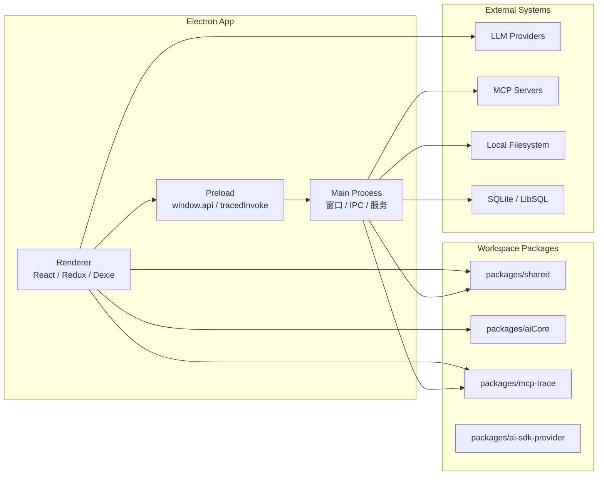
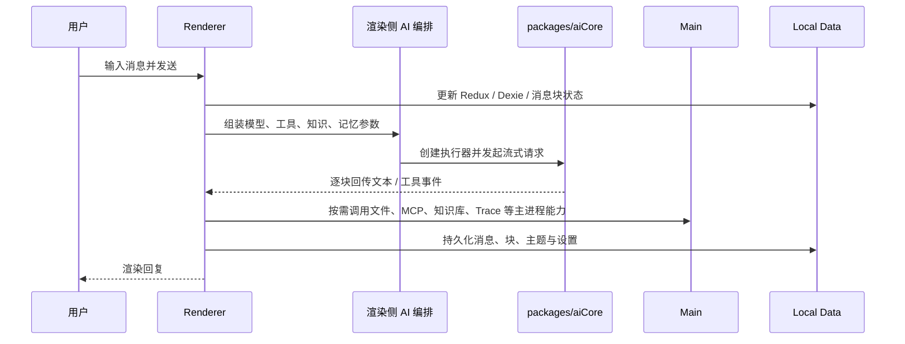

# 01-总览

## 项目定位

Cherry Studio 是一个跨平台桌面 AI 工作台。它不只做聊天，还把多模型、知识库、MCP、文件处理、长期记忆、Agent、备份同步和多窗口交互统一在同一个 Electron 应用中。

因此它不是典型的“前端页面 + 远端接口”结构，而是下面这种桌面应用组合体：

- Electron 主进程掌管系统权限、窗口和长期运行服务。
- Preload 负责把高权限能力收敛成受控 API。
- React 渲染进程负责交互、状态和产品层编排。
- Workspace 包提供跨运行时复用的 AI、Trace 和共享类型。

## Monorepo 结构

```text
.
├── src/
│   ├── main/        # Electron 主进程
│   ├── preload/     # 安全桥
│   └── renderer/    # React UI 与多窗口 HTML 入口
├── packages/
│   ├── aiCore/
│   ├── ai-sdk-provider/
│   ├── extension-table-plus/
│   ├── mcp-trace/
│   └── shared/
├── docs/
├── scripts/
└── tests/
```

## 系统视角



## 启动链路

当前启动路径可以概括成：

1. Electron 启动主进程，进入 `src/main/index.ts`。
2. 主进程先加载 `bootstrap` 和配置，设置 crash reporter、单实例锁、平台开关。
3. `app.whenReady()` 后执行数据恢复、创建主窗口、初始化托盘、菜单、Trace、分析、快捷键、IPC、选择助手等服务。
4. 主窗口加载 `src/renderer/index.html`。
5. HTML 先执行 `src/renderer/src/init.ts`，完成 `window.keyv`、自动同步、StoreSync、WebTrace 初始化。
6. 再执行 `src/renderer/src/entryPoint.tsx`，挂载 React `App`。
7. `App.tsx` 装配 Redux、React Query、主题、通知和路由，进入产品 UI。

## 为什么这样分层

### 1. Electron 权限模型决定必须分层

文件、窗口、系统设置、原生集成都不应该直接暴露给渲染进程。

### 2. 这个项目有大量长期运行能力

例如：

- MCP Server 生命周期管理
- 备份与自动同步
- 本地知识库处理
- Agent 与渠道接入
- Trace 与日志缓存
- OpenClaw、Code Tools、API Server

这些逻辑更适合放在主进程服务，而不是页面组件里。

### 3. AI 能力本身就有独立架构

Cherry Studio 不是“页面里直接请求模型”，而是由渲染侧产品编排层、`packages/aiCore` 执行内核和主进程扩展能力三层协作完成。

## 一次典型请求怎么流动

以“用户在主窗口发送一条消息”为例：



## 当前架构关键词

- 多进程：主进程、主窗口、迷你窗口、选择助手窗口、Trace 窗口。
- 多存储：Redux Persist、Dexie、文件系统、SQLite 同时存在。
- 多入口：构建时显式区分 `main`、`preload`、`renderer`，renderer 下又有多个 HTML 入口。
- 多 provider：AI 请求通过统一接口执行，但底层模型和能力差异很大。
- 多协议：IPC、MCP、供应商原生 API、OpenAI-compatible、渠道适配共同存在。
