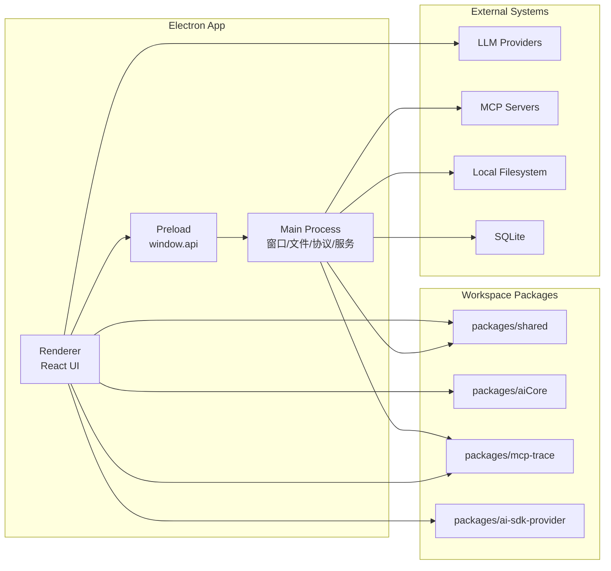
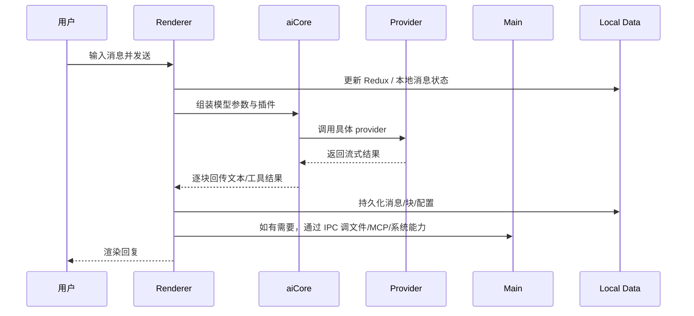

# 01-总览

## 项目定位

Cherry Studio 是一个跨平台桌面 AI 客户端。它的设计目标不是只接一个模型，而是把多模型对话、知识库、工具调用、MCP、文件处理、备份同步、插件化能力统一到一个桌面壳中。

因此它的架构天然不是“前端页面 + 后端接口”二层结构，而是下面这类桌面应用组合体：

- Electron 主进程负责桌面系统能力和长生命周期服务。
- React 渲染进程负责交互界面与用户工作流。
- Preload 把 Electron 能力裁剪成前端可安全调用的 API。
- Workspace 包提供模型抽象、共享类型、追踪和 SDK 扩展。

## Monorepo 结构

```text
.
├── src/
│   ├── main/        # Electron 主进程
│   ├── preload/     # 安全桥
│   └── renderer/    # 前端与多窗口 HTML 入口
├── packages/
│   ├── aiCore/      # 模型执行抽象
│   ├── ai-sdk-provider/
│   ├── mcp-trace/
│   ├── shared/
│   └── extension-table-plus/
├── docs/
├── tests/
└── scripts/
```

`pnpm-workspace.yaml` 说明这是一个 workspace 仓库，`packages/*` 中的包由主应用直接引用。

## 系统视角



## 启动链路

主应用的启动链路可以概括成：

1. Electron 启动主进程，进入 `src/main/index.ts`。
2. 主进程先做 bootstrap、配置初始化、崩溃处理、单实例锁等底座工作。
3. `windowService.createMainWindow()` 创建主窗口，并指定 preload 文件。
4. 主进程注册 IPC、快捷键、托盘、协议、追踪、API Server 等服务。
5. 窗口加载 `src/renderer/index.html`。
6. HTML 依次执行 `src/renderer/src/init.ts` 和 `src/renderer/src/entryPoint.tsx`。
7. React 渲染 `App`，挂载 Redux、React Query、主题、路由。

## 为什么要这样分层

### 1. Electron 的权限模型决定了必须分层

系统文件、窗口、托盘、协议、原生能力都只能安全地由主进程掌控；UI 渲染和用户交互更适合放在 React 中。

### 2. 这个项目需要多种“长期运行能力”

例如：

- 自动备份
- MCP Server 生命周期管理
- 本地知识库处理
- 追踪与日志
- API Server 自动启动

这些能力都不适合塞进前端页面组件。

### 3. 模型接入复杂度很高

项目同时支持多种模型供应商、工具调用方式、Web Search、图像生成、插件链和自定义 provider，所以抽出了 `packages/aiCore`。

## 一次典型请求怎么流动

以“用户在首页发一条消息”为例：



## 架构上的几个关键词

- 多进程：主进程与多个渲染窗口并存。
- 多存储：Redux Persist、Dexie、文件系统、SQLite 同时存在。
- 多入口：主窗口、迷你窗口、选择助手窗口、Trace 窗口。
- 多 provider：模型调用统一抽象，但底层能力差异很大。
- 多协议：本地 IPC、MCP、OpenAI-compatible、供应商原生协议共同存在。

