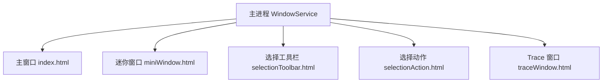
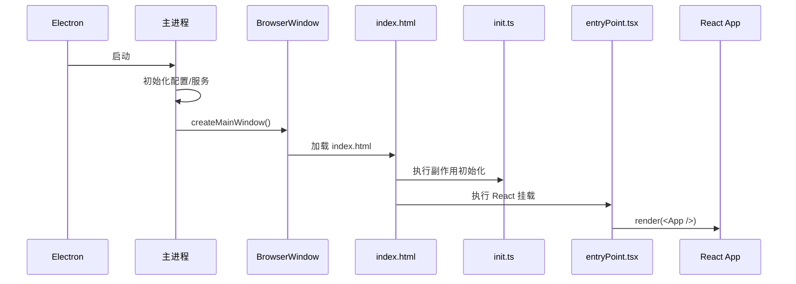

# 02-运行时架构

## 运行时组成

Cherry Studio 的“运行时”不是单个 JS 进程，而是 Electron 下的多个角色协作：

- 主进程：唯一的桌面宿主。
- 主窗口渲染进程：应用主体 UI。
- 其他渲染窗口：如 miniWindow、selectionToolbar、selectionAction、traceWindow。
- preload：每个窗口和主进程之间的桥。

`electron.vite.config.ts` 明确声明了三类构建目标：

- `main`
- `preload`
- `renderer`

同时，renderer 构建包含多个 HTML 入口：

- `index.html`
- `miniWindow.html`
- `selectionToolbar.html`
- `selectionAction.html`
- `traceWindow.html`

## 运行时分工

| 角色 | 负责内容 |
| --- | --- |
| 主进程 | 应用生命周期、窗口、托盘、协议、IPC、文件系统、系统设置、服务编排 |
| 主窗口渲染进程 | 聊天、设置、知识库、文件、笔记、绘图、翻译等主要 UI |
| Mini Window | 轻量助手窗口 |
| Selection Windows | 选中文本后的工具栏和动作窗口 |
| Trace Window | 展示调用链与追踪数据 |
| Preload | 受控暴露 Electron / IPC 能力，阻断直接 Node 访问 |

## 多窗口结构

## 主窗口启动原理

在 `src/main/index.ts` 中，主进程完成这些工作：

- 初始化 crash reporter
- 根据设置关闭硬件加速
- 设置平台相关命令行参数
- 建立单实例锁
- `app.whenReady()` 后创建主窗口
- 初始化追踪、分析、快捷键、协议、IPC、选择助手、API Server

这说明主进程不是一个“只负责开窗”的薄壳，而是系统协调中心。

## 渲染进程启动原理

主窗口的 HTML 入口是 `src/renderer/index.html`，它会先加载：

- `/src/init.ts`
- `/src/entryPoint.tsx`

其中：

- `init.ts` 做 Keyv 初始化、自动同步、Store 跨窗口同步、Web Trace 初始化。
- `entryPoint.tsx` 负责把 React App 挂到 `#root`。

这种拆法的好处是把“副作用初始化”和“UI 挂载”分开。

## 路由与导航

`src/renderer/src/Router.tsx` 使用 `HashRouter` 而不是 BrowserRouter，原因很典型：

- Electron 本地文件或内部 URL 环境更适合 Hash 路由。
- 避免桌面环境下路径刷新时的资源解析问题。

路由覆盖的核心页面包括：

- `/` 首页对话
- `/agents`
- `/knowledge`
- `/files`
- `/notes`
- `/paintings/*`
- `/translate`
- `/settings/*`
- `/apps`
- `/openclaw`

## 运行时初始化顺序图

## 为什么需要多个窗口

这个项目的一些能力天然适合独立窗口：

- 迷你助手需要轻量、可悬浮、可快速唤起。
- 选择助手需要跟随系统文本选择行为。
- Trace 窗口需要与主界面解耦，独立展示追踪链路。

所以这里不是单纯“多页面”，而是 Electron 级别的多窗口协同。

