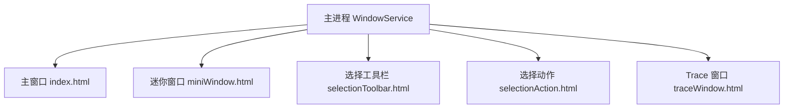

# 02-运行时架构

## 运行时组成

Cherry Studio 的运行时不是单个 JS 进程，而是 Electron 下多个角色协作：

- 主进程：唯一桌面宿主。
- 主窗口渲染进程：应用主体 UI。
- 其他渲染窗口：`miniWindow`、`selectionToolbar`、`selectionAction`、`traceWindow`。
- Preload：每个窗口和主进程之间的安全桥。

`electron.vite.config.ts` 明确把构建切成三类目标：

- `main`
- `preload`
- `renderer`

其中 renderer 当前包含 5 个 HTML 入口：

- `index.html`
- `miniWindow.html`
- `selectionToolbar.html`
- `selectionAction.html`
- `traceWindow.html`

## 运行时分工

| 角色 | 负责内容 |
| --- | --- |
| 主进程 | 应用生命周期、窗口、协议、托盘、快捷键、IPC、系统服务编排 |
| 主窗口 | 聊天、知识库、文件、笔记、代码工具、设置、Agent、OpenClaw 等主界面 |
| Mini Window | 轻量悬浮助手 |
| Selection Windows | 系统文本选择后的工具栏和动作窗口 |
| Trace Window | Trace 可视化展示 |
| Preload | 暴露受控能力，阻断渲染进程直接访问 Node/Electron 高权限 API |

## 多窗口结构

## 主进程启动原理

`src/main/index.ts` 当前的大致顺序是：

1. 预加载 `bootstrap` 与配置。
2. 设置 crash reporter、单实例锁、平台特性开关。
3. `app.whenReady()` 后记录版本、处理备份恢复。
4. 创建主窗口、托盘和应用菜单。
5. 初始化 Trace、PowerMonitor、Analytics、快捷键、IPC。
6. 启动选择助手、本地传输发现、Agent bootstrap、API Server、Scheduler、ChannelManager。

这说明主进程不是“只负责开窗”的薄壳，而是整个桌面应用的协调中心。

## 渲染进程启动原理

主窗口 HTML 入口是 `src/renderer/index.html`，依次加载：

- `/src/init.ts`
- `/src/entryPoint.tsx`

其中：

- `init.ts` 负责 `window.keyv`、自动同步、跨窗口 StoreSync、WebTrace。
- `entryPoint.tsx` 负责样式入口和 React 挂载。

这样把副作用初始化和 UI 启动拆开，降低了主入口复杂度。

## 路由与导航

`src/renderer/src/Router.tsx` 使用 `HashRouter`，并在运行时选择两套壳：

- 左侧导航模式：`Sidebar + Routes`
- 顶部标签模式：`TabsContainer + Routes`

路由入口当前包括：

- `/`：首页聊天
- `/agents`
- `/store`
- `/paintings/*`
- `/translate`
- `/files`
- `/notes`
- `/knowledge`
- `/apps` 与 `/apps/:appId`
- `/code`
- `/openclaw`
- `/settings/*`
- `/launchpad`

另外在正式进入路由前，会先检查 onboarding 状态。

## 运行时初始化顺序图

## 为什么需要多个窗口

这里不是单纯的“多页面”，而是 Electron 级别的多窗口协同：

- 迷你助手需要轻量、悬浮、快速唤起。
- 选择助手需要跟随系统文本选择。
- Trace 需要和主界面解耦，独立展示调试数据。
- 多窗口之间还要通过 `StoreSyncService` 同步部分状态。
