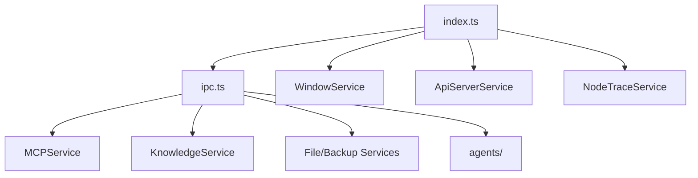

# 03-主进程

## 主进程职责

主进程目录是 `src/main/`。它承担的不是传统 Web 后端职责，而是桌面宿主职责：

- 管理 Electron 生命周期
- 创建和管理窗口
- 暴露系统能力
- 注册 IPC 处理器
- 托管长生命周期服务
- 处理本地数据、文件、协议、MCP、追踪、更新、备份

## 结构概览

```text
src/main/
├── index.ts
├── ipc.ts
├── services/
├── apiServer/
├── mcpServers/
├── knowledge/
├── integration/
├── utils/
└── configs/
```

## 启动入口 `index.ts`

主进程入口的核心动作包括：

- 加载 `./bootstrap`
- 加载 `@main/config`
- 初始化崩溃报告
- 根据设置调整硬件加速和平台特性
- 申请单实例锁
- `app.whenReady()` 后依次初始化窗口、托盘、菜单、追踪、分析、快捷键、IPC、选择助手和 API Server

从这里可以看出：项目把“应用级初始化编排”集中放在一个入口，不把这些逻辑分散到窗口创建或页面加载里。

## `WindowService`：窗口中心

`src/main/services/WindowService.ts` 是窗口系统的核心：

- 创建主窗口和 miniWindow
- 统一设置 `BrowserWindow` 参数
- 注入 preload
- 管理窗口状态恢复
- 处理最大化、全屏、缩放、上下文菜单
- 监听渲染进程 crash 并决定 reload 或退出

这意味着窗口不是随手 new 出来，而是被统一建模。

## `ipc.ts`：桌面能力汇聚点

`src/main/ipc.ts` 是主进程能力的总暴露层，集中注册 `ipcMain.handle(...)`。

这里的 handler 覆盖：

- 应用设置与生命周期
- 文件与目录操作
- 备份恢复
- MCP 调用
- 通知
- 窗口控制
- 知识库操作
- OCR / Python / Webview / VertexAI 等集成能力
- API Server 状态管理

这层的作用相当于“桌面内部 API 网关”。

## 主要服务分组

### 桌面与系统类

- `WindowService`
- `TrayService`
- `ShortcutService`
- `ThemeService`
- `ProtocolClient`
- `PowerMonitorService`

### 数据与文件类

- `FileStorage`
- `FileSystemService`
- `BackupManager`
- `StoreSyncService`

### AI 与知识类

- `KnowledgeService`
- `MemoryService`
- `AnthropicService`
- `CopilotService`
- `OpenClawService`
- `PythonService`

### 集成与基础设施类

- `MCPService`
- `ApiServerService`
- `NodeTraceService`
- `AnalyticsService`

## API Server 为什么在主进程里

`src/main/index.ts` 里会在后台尝试启动 `apiServerService`。这样做有两个原因：

- API Server 依赖本地配置、agents 数据和系统资源，属于桌面宿主能力。
- 即使前端页面没有主动发请求，主进程也可以基于配置和 agent 存在情况决定是否启动它。

## agents 子系统

`src/main/services/agents/` 使用 Drizzle ORM + SQLite 管理 agent、session、message 等数据。它属于主进程域，而不是前端 Dexie 域。

这套设计说明项目把“用户界面状态”和“agent 业务实体”分开存储：

- 前者偏 UI 和本地体验
- 后者偏可管理、可校验、可服务化的数据模型

## 主进程内聚图



## 设计原理

主进程遵循的是“系统能力集中、前端最小授权”原则：

- 不让渲染进程直接接触 Node 或 Electron 高权限 API。
- 高权限逻辑先在主进程建模为服务，再通过 IPC 精准暴露。
- 跨页面、跨窗口、跨会话都需要长期持有的资源，由主进程掌控。

