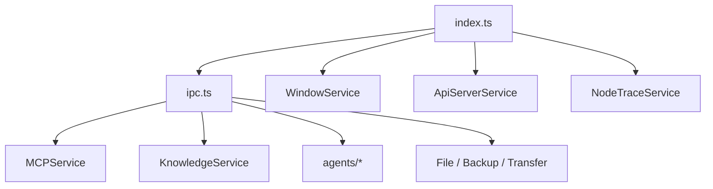

# 03-主进程

## 主进程职责

主进程目录是 `src/main/`。它承担的不是传统 Web 后端职责，而是桌面宿主职责：

- 管理 Electron 生命周期
- 创建和管理窗口
- 注册 IPC、协议和高权限能力
- 托管 MCP、知识库、Agent、备份、传输、Trace 等长期运行服务
- 维护本地文件、配置、日志和 API Server

## 结构概览

```text
src/main/
├── index.ts
├── ipc.ts
├── apiServer/
├── configs/
├── integration/
├── knowledge/
├── mcpServers/
├── services/
├── utils/
└── constant.ts
```

## 启动入口 `index.ts`

`src/main/index.ts` 当前承担的是“应用级编排”：

- 加载 `bootstrap` 和 `@main/config`
- 初始化 crash reporter、平台命令行参数、单实例锁
- 处理备份恢复与版本记录
- 创建主窗口、托盘、菜单
- 初始化 Trace、Analytics、PowerMonitor、快捷键、IPC
- 处理 deep link、选择助手、本地传输发现
- 启动内置 Agent、API Server、Scheduler 与渠道适配器

这里集中的是时序和依赖关系，而不是零散的业务逻辑。

## `WindowService`：窗口中心

`src/main/services/WindowService.ts` 是窗口系统核心，负责：

- 创建主窗口与迷你窗口
- 设置 `BrowserWindow` 参数和 preload
- 恢复窗口状态
- 控制显示、隐藏、最大化、全屏、缩放
- 处理崩溃和上下文菜单

项目里的窗口不是“随手 new 出来”，而是统一经由服务管理。

## `ipc.ts`：桌面能力汇聚点

`src/main/ipc.ts` 集中注册 `ipcMain.handle(...)`，把 preload 暴露的 API 路由到主进程服务。

当前覆盖的能力非常广，包括：

- 应用设置、主题、更新、代理、字体、权限
- 文件与目录操作、缓存清理、导入导出
- 备份恢复、WebDAV、S3、本地传输
- MCP 调用与日志
- 知识库与记忆
- OCR、Python、Code Tools、Webview、Vertex AI
- Agent 消息持久化、Trace、通知、窗口控制

这层相当于 Cherry Studio 的“桌面内部 API 网关”。

## 主要服务分组

### 桌面与系统类

- `WindowService`
- `TrayService`
- `AppMenuService`
- `ShortcutService`
- `ThemeService`
- `ProtocolClient`
- `PowerMonitorService`
- `VersionService`

### 数据与文件类

- `FileStorage`
- `FileSystemService`
- `BackupManager`
- `StoreSyncService`
- `ExportService`
- `ObsidianVaultService`

### AI 与产品能力类

- `MCPService`
- `KnowledgeService`
- `memory/MemoryService`
- `OpenClawService`
- `CodeToolsService`
- `PythonService`
- `SearchService`
- `VertexAIService`
- `CopilotService`

### 基础设施与集成类

- `ApiServerService`
- `NodeTraceService`
- `AnalyticsService`
- `ProxyManager`
- `NotificationService`
- `LocalTransferService`
- `lanTransfer/*`
- `ExternalAppsService`

## Agent 子系统

`src/main/services/agents/` 是独立子系统，当前主要包含：

- `database/`：Drizzle schema、repository、迁移
- `services/`：Agent、Session、Scheduler、Claude Code、Channels、CherryClaw、安全控制
- `skills/`：技能安装与管理

这部分数据由主进程托管，和前端 Dexie/Redux 状态分开。

## 主进程内聚图



## 设计原则

- 高权限逻辑先在主进程建模成服务，再通过 IPC 精准暴露。
- 需要跨窗口、跨会话、跨进程长期存在的资源，由主进程持有。
- 渲染进程不直接接触 Node 或 Electron 高权限接口。
- 新功能优先复用现有服务，不在 `ipc.ts` 里堆业务逻辑。
