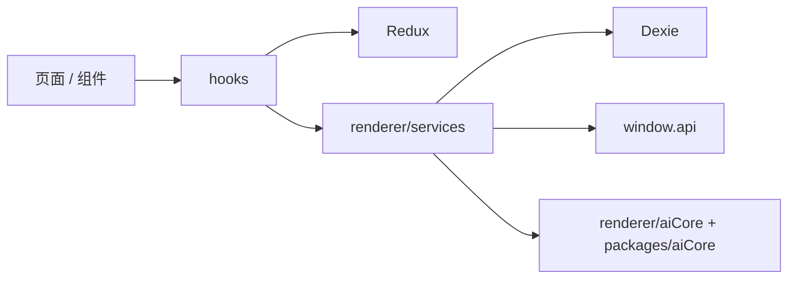

# 04-渲染进程

## 渲染进程的角色

渲染进程目录是 `src/renderer/src/`，本质上是一组 React 19 窗口应用，而不只是单页 UI。

它负责：

- 用户交互与页面路由
- Redux / Dexie 本地状态
- 渲染侧 AI 编排
- 文件、知识库、笔记、代码工具等产品工作流
- 主窗口和多窗口前端壳

## 结构概览

```text
src/renderer/src/
├── App.tsx
├── Router.tsx
├── entryPoint.tsx
├── init.ts
├── api/
├── components/
├── context/
├── databases/
├── hooks/
├── pages/
├── services/
├── store/
├── trace/
├── types/
├── windows/
└── aiCore/
```

## 应用壳 `App.tsx`

当前顶层上下文顺序是：

1. Redux `Provider`
2. `QueryClientProvider`
3. `StyleSheetManager`
4. `ThemeProvider`
5. `AntdProvider`
6. `NotificationProvider`
7. `CodeStyleProvider`
8. `PersistGate`
9. `TopViewContainer`
10. `Router`

这说明渲染层已经形成固定的应用壳，而不是页面级零散初始化。

## 路由层 `Router.tsx`

路由层当前负责四件事：

1. 检查 onboarding 是否完成。
2. 统一用 `HashRouter` 管理桌面环境路由。
3. 根据导航位置切换 `Sidebar` 或 `TabsContainer` 布局。
4. 挂载主页面路由与导航处理器。

主要页面包括：

- 对话与助手：`home`、`agents`、`store`
- 内容与知识：`knowledge`、`files`、`notes`
- 工具能力：`translate`、`code`、`paintings`
- 平台能力：`openclaw`、`launchpad`
- 轻应用：`apps`、`apps/:appId`
- 系统配置：`settings/*`

## 目录分工

| 目录 | 用途 |
| --- | --- |
| `pages/` | 页面级业务容器 |
| `components/` | 复用 UI 组件 |
| `hooks/` | 业务状态与页面逻辑抽取 |
| `services/` | 副作用、DB 封装、AI/知识/文件服务 |
| `store/` | Redux slice、migrate、persist 配置 |
| `databases/` | Dexie 数据库与升级逻辑 |
| `windows/` | 迷你窗口与选择助手窗口前端 |
| `trace/` | Trace 窗口前端实现 |
| `aiCore/` | 渲染侧 AI 编排与适配层 |

## 为什么渲染侧也有 `aiCore/`

因为很多 AI 逻辑贴近产品交互，而不应该全部塞进主进程：

- 消息和文件如何变成模型参数
- 工具可见性和产品策略如何组合
- Chunk 如何转成 UI 状态
- 哪些请求需要接 Trace、知识库或 MCP

因此渲染侧 `aiCore/` 负责“产品编排”，`packages/aiCore` 负责“统一执行内核”。

## 多窗口前端

当前独立窗口入口包括：

- `windows/mini/entryPoint.tsx`
- `windows/selection/toolbar/entryPoint.tsx`
- `windows/selection/action/entryPoint.tsx`
- `trace/traceWindow.tsx`

这些窗口通常会做额外初始化：

- 调用 `loggerService.initWindowSource(...)`
- 订阅 `StoreSyncService`
- 通过 `window.api` 获取主进程能力

## 渲染层工作方式



## 设计原则

- 页面组织以用户工作流为中心，不是传统 MVC。
- hooks 负责交互状态复用，services 负责副作用。
- store 保存跨组件共享状态，Dexie 保存结构化本地数据。
- 需要高权限资源时通过 `window.api` 过边界。

## 聊天消息列表与滚动

主窗口与 Agent 会话的消息列表使用反向列布局和显式滚动控制，具体细节见：

[主窗口聊天消息列表与滚动](./主窗口聊天消息列表与滚动/README.md)
