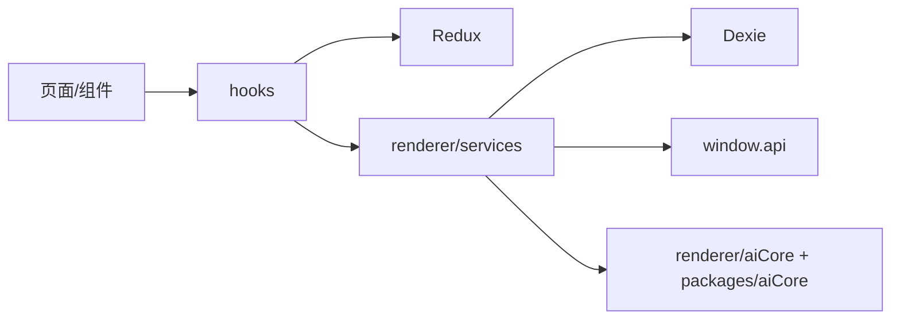

# 04-渲染进程

## 渲染进程的角色

渲染进程目录是 `src/renderer/src/`，本质上是一个 React 19 应用集合，不只是单页 UI。

它负责：

- 用户交互
- 页面路由
- 消息渲染
- 本地状态管理
- 模型参数组装
- 本地数据库读写
- 多窗口前端壳

## 结构概览

```text
src/renderer/src/
├── App.tsx
├── Router.tsx
├── entryPoint.tsx
├── init.ts
├── pages/
├── components/
├── hooks/
├── services/
├── store/
├── databases/
├── windows/
├── trace/
└── aiCore/
```

## 应用壳 `App.tsx`

`App.tsx` 把几个关键上下文按固定顺序包起来：

- Redux `Provider`
- React Query `QueryClientProvider`
- 样式管理
- 主题
- Ant Design Provider
- 通知 Provider
- 代码样式 Provider
- `PersistGate`
- 顶层浮层容器
- Router

说明这个前端不是“纯页面拼接”，而是一个有状态、有全局上下文、有多种 UI 基础设施的应用壳。

## 路由层 `Router.tsx`

路由层负责三件事：

1. 根据 onboarding 状态决定是否先展示引导页。
2. 根据导航栏位置决定使用侧边布局还是 Tab 容器布局。
3. 把主要页面挂到路由表。

页面分布可以粗分为：

- 对话与助手：`home`、`agents`
- 知识与内容：`knowledge`、`files`、`notes`
- 工具能力：`translate`、`code`、`paintings`
- 系统配置：`settings`
- 轻应用生态：`minapps`、`launchpad`

## 目录分工

| 目录 | 用途 |
| --- | --- |
| `pages/` | 页面级业务容器 |
| `components/` | 可复用 UI 组件 |
| `hooks/` | 状态、订阅、页面逻辑抽取 |
| `services/` | 前端业务服务、消息流处理、DB 封装 |
| `store/` | Redux slice 与持久化 |
| `databases/` | Dexie 数据库定义 |
| `windows/` | 独立窗口入口与窗口应用 |
| `trace/` | Trace 窗口前端实现 |
| `aiCore/` | 渲染侧模型调用封装与兼容层 |

## 为什么渲染侧也有 `aiCore/`

因为模型请求并不都必须走主进程。对话、流式输出、工具编排、provider 参数转换等更接近交互层，所以渲染侧保留了一层模型调用组织代码。

它的特点是：

- 贴近 UI 状态和用户配置
- 负责参数预处理、插件组合、流回调接线
- 与 `packages/aiCore` 协同，而不是完全替代它

## 多窗口前端

`windows/` 目录说明渲染进程不只有主界面：

- `windows/mini/entryPoint.tsx`
- `windows/selection/toolbar/entryPoint.tsx`
- `windows/selection/action/entryPoint.tsx`
- `trace/traceWindow.tsx`

这些窗口通常会做两件额外的初始化：

- 初始化窗口级日志来源
- 订阅 `StoreSyncService`，共享部分 Redux 更新

## 渲染层工作方式



## 设计原理

渲染层强调的是“面向用户工作流”的组织方式，而不是传统 MVC：

- 页面负责业务场景。
- hooks 负责交互状态和复用逻辑。
- services 负责副作用。
- store 负责跨组件共享状态。
- 数据库负责本地持久化。
- `window.api` 负责越权边界外的能力调用。

换句话说，渲染层只做它最擅长的事：把复杂能力编排成可操作的桌面体验。

