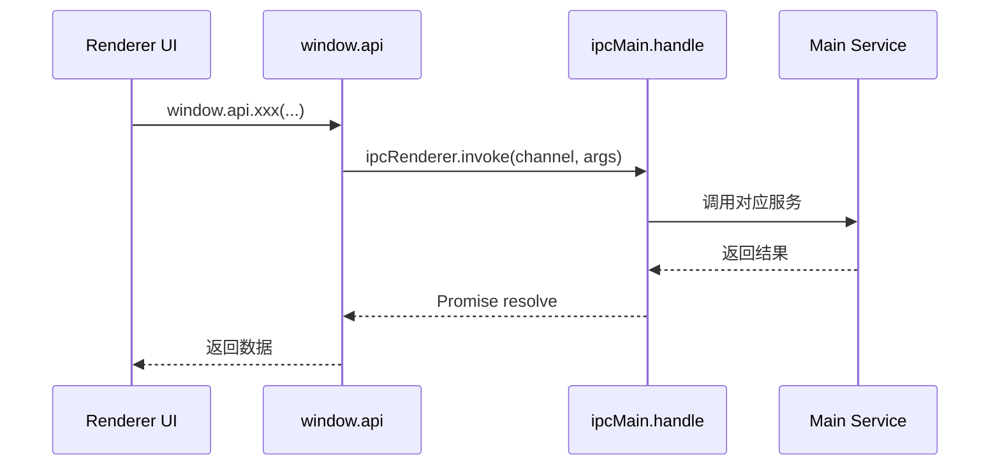

# 05-预加载与 IPC

## 为什么需要 preload

Electron 中最危险的做法之一，就是让渲染进程直接拥有 Node 权限。Cherry Studio 采用的是更稳妥的模型：

- 主进程持有高权限。
- preload 作为桥梁。
- 渲染进程通过 `window.api` 和受控的 `electronAPI` 使用能力。

这就是 `src/preload/index.ts` 的职责。

## Preload 的工作内容

`src/preload/index.ts` 当前主要做三件事：

1. 定义 `tracedInvoke()`，让 IPC 可以携带 span context。
2. 通过 `contextBridge` 暴露 `window.api`，按命名空间提供主进程能力。
3. 暴露 Electron Toolkit 提供的基础 `electronAPI` 能力。

`window.api` 下的接口已经覆盖多个域，例如：

- `app`
- `system`
- `notification`
- `backup`
- `file`
- `mcp`
- `trace`
- `storeSync`
- API Server 与 Agent 相关接口

这层不是简单工具函数，而是主进程和渲染进程之间的正式契约。

## IPC 契约来源

所有 channel 常量统一定义在 `packages/shared/IpcChannel.ts`。这样做的好处是：

- 主进程和渲染进程共用同一套命名。
- 避免字符串散落在代码库。
- 方便追踪、重构和类型统一。

## IPC 请求流

## `ipc.ts` 的角色

`src/main/ipc.ts` 是主进程 handler 的集中注册地。它负责：

- 把 preload 暴露的 channel 路由到服务层
- 统一做边界控制和错误入口收口
- 为 Trace、日志、通知等横切能力留出统一接入点

也就是说，preload 定义“能调什么”，`ipc.ts` 决定“具体由谁实现”。

## Store 跨窗口同步

Cherry Studio 不只使用请求应答型 IPC，还通过 action 广播做跨窗口同步：

1. 渲染侧 `StoreSyncService` 中间件拦截指定 action。
2. 通过 preload 把同步 action 发到主进程。
3. 主进程广播给其他窗口。
4. 其他窗口把 action dispatch 回各自本地 store。

当前默认同步的是少数状态切片，而不是整份 Redux store。

## Trace 与 IPC 的结合

预加载层的 `tracedInvoke(channel, spanContext, ...args)` 允许渲染侧把 trace context 一起带到主进程。

这让 IPC 在这里不只是通信通道，也是统一追踪链路的一部分：

- 渲染侧 span 可以跨 IPC 继续传递。
- 主进程 `NodeTraceService` 可以接住并继续记录。
- Trace Window 能看到更完整的端到端链路。

## 边界原则

- 渲染进程只拿到它需要的、被允许的能力。
- 能在渲染侧完成的逻辑，不强制上主进程。
- 只要涉及文件、窗口、系统设置、长期运行服务，就走 IPC。
- 新接口优先落在现有命名空间，避免 `window.api` 无序膨胀。
