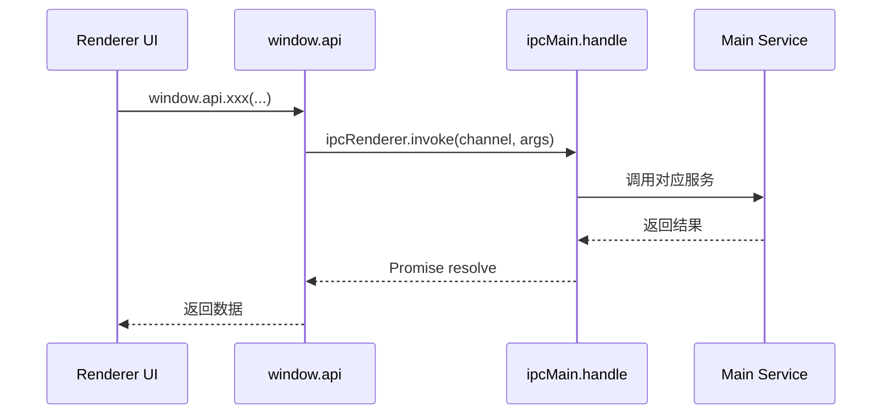

# 05-预加载与 IPC

## 为什么需要 preload

Electron 中最危险的做法之一，就是让渲染进程直接拥有 Node 权限。Cherry Studio 采用的是更稳妥的模型：

- 主进程持有高权限。
- preload 作为桥梁。
- 渲染进程通过 `window.api` 使用能力。

这就是 `src/preload/index.ts` 的职责。

## Preload 的工作内容

`src/preload/index.ts` 做了两类事情：

1. 定义 `tracedInvoke()`，让 IPC 调用可携带 trace context。
2. 构造 `api` 对象，把主进程能力按命名空间暴露给渲染进程。

暴露内容非常广，包括：

- `app`
- `system`
- `notification`
- `backup`
- `file`
- MCP
- API Server
- 插件管理
- store sync
- 窗口控制

这说明 preload 不是薄薄一层工具函数，而是前后端边界的正式契约层。

## IPC 契约来源

所有 channel 常量定义在 `packages/shared/IpcChannel.ts`，好处是：

- 主进程和渲染进程共用同一套名字
- 避免字符串散落
- 有利于类型与语义集中管理

## IPC 请求流



## `ipc.ts` 的角色

`src/main/ipc.ts` 是所有 IPC handler 的集中注册地。它把 `window.api` 背后的实现路由到主进程服务。

这层的价值在于：

- 权限隔离
- 参数入口集中
- 服务调用边界清晰
- 更容易做日志、追踪和错误归一化

## Store 跨窗口同步

除了普通请求应答型 IPC，本项目还有广播型 IPC。

`src/renderer/src/services/StoreSyncService.ts` 的机制是：

- Redux middleware 拦截指定 action
- 通过 `window.api.storeSync.onUpdate(...)` 发到主进程
- 主进程再广播给其他窗口
- 其他窗口收到 `IpcChannel.StoreSync_BroadcastSync` 后把 action dispatch 回本地 store

这是一种“以 action 为最小同步单位”的跨窗口状态复制，而不是直接同步整份 store。

## Trace 与 IPC 的结合

`NodeTraceService` 重写了 `ipcMain.handle` 的包裹逻辑，使 IPC 调用能把 span context 从渲染进程带到主进程，再进入统一追踪链。

对应的 preload 中有：

```ts
tracedInvoke(channel, spanContext, ...args)
```

这说明 IPC 在这里不仅是通信通道，也是观测链路的一部分。

## 边界原则

这一层体现的原则很明确：

- 渲染进程只拿到“允许它使用”的能力。
- 能在渲染侧完成的，不一定上主进程。
- 必须接触系统资源、文件、窗口、长生命周期服务的，再走 IPC。
- IPC 名称、类型和调用路径尽量标准化。

