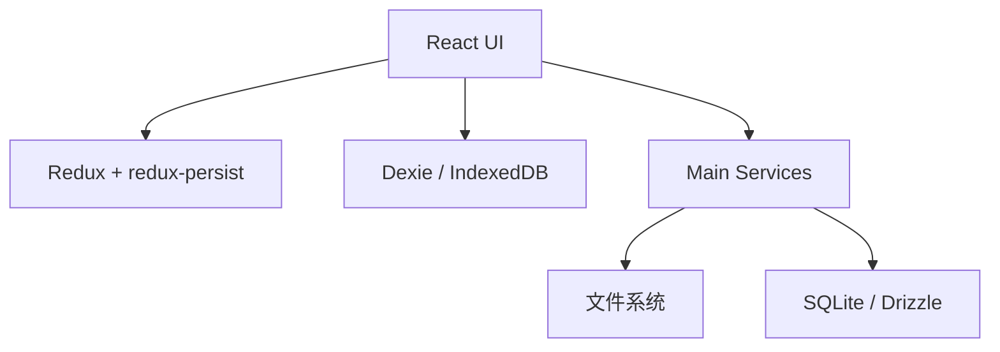

# 06-数据与状态

## 这不是单一存储架构

Cherry Studio 同时使用多种状态与数据机制：

- Redux：界面级共享状态
- redux-persist：前端状态持久化
- Dexie / IndexedDB：结构化本地数据
- 文件系统：附件、导入导出、备份、笔记目录、缓存
- SQLite / Drizzle：主进程 Agent 业务数据

它的设计不是“所有东西进一个数据库”，而是按职责分层存储。

## Redux：UI 状态中心

`src/renderer/src/store/index.ts` 当前的 `rootReducer` 包含这些主要切片：

- `assistants`
- `backup`
- `codeTools`
- `copilot`
- `knowledge`
- `llm`
- `mcp`
- `memory`
- `messages`
- `messageBlocks`
- `minapps`
- `note`
- `nutstore`
- `ocr`
- `openclaw`
- `paintings`
- `preprocess`
- `runtime`
- `selectionStore`
- `settings`
- `shortcuts`
- `tabs`
- `toolPermissions`
- `translate`
- `websearch`

此外还有：

- `redux-persist` 持久化
- 自定义 `migrate`
- `StoreSyncService` 跨窗口同步

Redux 在这里更接近“应用会话状态”和“产品配置中心”，而不是业务数据库。

## Redux 的定位

适合放 Redux 的：

- 当前 UI 配置
- 当前激活状态和运行时标记
- 需要跨组件共享的页面状态
- 需要在窗口之间同步的轻量数据

不适合全部放 Redux 的：

- 大附件
- 长文本块和复杂实体集合
- 主进程托管的 Agent 业务对象

## Dexie：前端结构化数据

`src/renderer/src/databases/index.ts` 定义了 IndexedDB 数据库 `CherryStudio`。当前 schema 已演进到 `version(10)`，主要表包括：

- `files`
- `topics`
- `settings`
- `knowledge_notes`
- `translate_history`
- `translate_languages`
- `quick_phrases`
- `message_blocks`

可以从源码看到它经历了多次升级函数和表结构调整，这也是为什么文档里要把它视作“演进中的前端本地数据层”，而不是完全稳定的公共接口。

## 文件系统：真实的大对象存储

项目大量能力直接依赖本地文件系统：

- 附件上传与读取
- 笔记目录
- 导入导出
- 备份与恢复
- 临时文件和缓存目录

因此文件系统在架构里不是边缘角色，而是关键数据层。

## SQLite：主进程业务实体

主进程下的 `src/main/services/agents/` 使用 Drizzle ORM + SQLite/LibSQL 保存更强结构化的业务数据，例如：

- agent 定义
- session
- session message
- scheduler 与渠道相关数据
- migration tracking

这部分数据和 Dexie 的区别是：

- 由主进程托管
- 更适合强约束和服务化访问
- 可被 API Server 与 Agent 子系统复用

## 多层存储关系

## 为什么要这样分层

### Redux 解决“当前界面怎么运转”

例如布局、设置、助手配置、工具权限、窗口同步状态。

### Dexie 解决“前端本地实体怎么存”

例如文件索引、知识笔记、翻译历史、消息块等结构化数据。

### SQLite 解决“主进程业务实体怎么管”

尤其是 Agent、Session、Scheduler 这些需要更严格边界的数据。

### 文件系统解决“真实文件怎么落地”

例如图片、PDF、导出文件、备份归档和笔记目录。

## 当前约束

仓库仍处于 v2 数据与 UI 重构窗口，`store/index.ts` 和 `databases/index.ts` 都带有受限说明。理解这一层时要记住两点：

- 现有实现是正在演进中的稳定基线。
- 不应轻易新增 Redux 状态形状或 Dexie schema 改动，除非是明确允许的关键修复。
