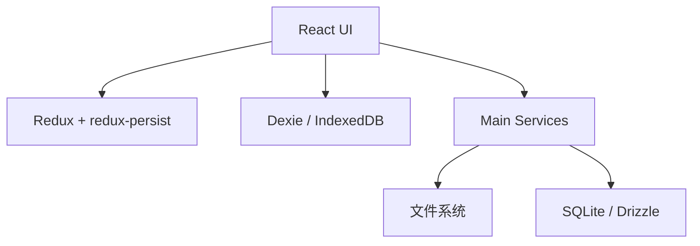

# 06-数据与状态

## 这不是单一存储架构

Cherry Studio 同时使用了多种状态与数据机制：

- Redux：界面级共享状态
- redux-persist：前端状态持久化
- Dexie / IndexedDB：结构化本地数据
- 文件系统：附件、导入导出、备份、笔记目录
- SQLite / Drizzle：agents 业务数据

它的设计不是“所有东西进一个数据库”，而是按职责拆存储。

## Redux：UI 状态中心

`src/renderer/src/store/index.ts` 是 Redux 入口。

可见特征：

- 使用 `combineReducers`
- 使用 `redux-persist`
- 使用自定义 `migrate`
- 通过 `StoreSyncService` 同步部分 slice 到其他窗口

典型 slice 包括：

- `assistants`
- `settings`
- `llm`
- `mcp`
- `knowledge`
- `paintings`
- `memory`
- `tabs`
- `note`
- `translate`

## Redux 的定位

Redux 在这里更接近“应用会话状态”和“配置状态”的中心，而不是完整业务数据库。

适合放 Redux 的：

- 当前 UI 配置
- 当前激活状态
- 需要跨组件共享的页面数据
- 需要持久化但不适合入数据库的前端状态

不适合全部放 Redux 的：

- 大附件
- 复杂本地实体集合
- agents 结构化业务实体

## Dexie：前端结构化数据

`src/renderer/src/databases/index.ts` 定义了 IndexedDB 数据库 `CherryStudio`。

当前可见表包括：

- `files`
- `topics`
- `settings`
- `knowledge_notes`
- `translate_history`
- `quick_phrases`
- `message_blocks`
- `translate_languages`

同时可见多个 schema version 和 upgrade 函数，这说明前端本地数据经历过演进，并且需要迁移。

## SQLite：agents 域数据

主进程下的 `src/main/services/agents/` 使用 Drizzle ORM + LibSQL/SQLite。

它保存的是更偏业务实体的数据，例如：

- agent 定义
- session
- session message
- migration tracking

这部分数据和 Dexie 不同：

- 它由主进程托管
- 更适合严格校验
- 更适合为 API Server 或 agent 服务复用

## 文件系统：真正的大对象存储

项目里大量能力直接依赖本地文件系统：

- 上传与读取附件
- 导入导出
- 笔记目录
- 备份归档
- 临时文件

因此文件系统在架构里不是边缘配角，而是重要的数据层。

## 多层存储关系

## 为什么要分层存储

### Redux 解决“当前界面怎么运转”

例如当前页面、设置、激活项、同步到其他窗口的配置。

### Dexie 解决“前端本地实体怎么存”

例如 topic、消息块、翻译历史、知识笔记等。

### SQLite 解决“主进程业务实体怎么管”

尤其是 agents 这样的服务化对象。

### 文件系统解决“真实文件怎么落地”

例如 PDF、图片、导出文件、备份包。

## 注意点

仓库当前处于 v2 重构阶段，`store/index.ts` 和 `databases/index.ts` 都带有“非关键功能变更受限”的说明头。文档理解时要把这一点记住：

- 现有实现可视为正在演进中的稳定基线
- UI 状态和数据模型未来仍可能继续迁移

