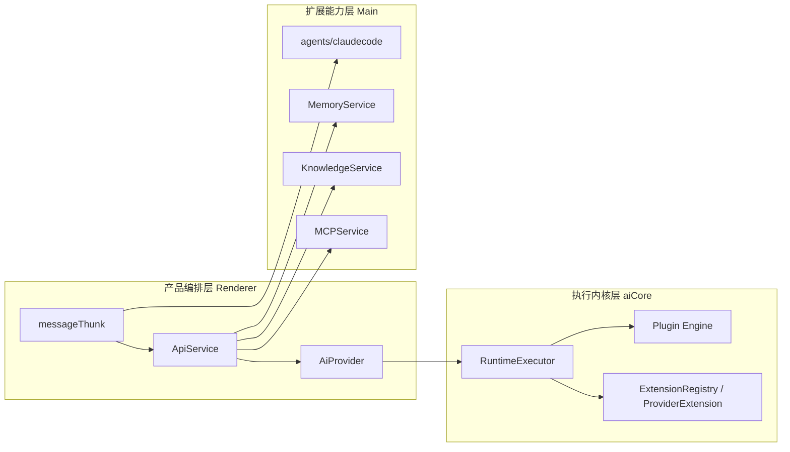

# 00-新人30分钟速通

本文是 `07-AI核心与模型接入` 的新人入口。目标不是一次性掌握所有实现细节，而是先建立稳定的”分层 + 主链路 + 扩展落点”心智模型，再逐步深入。

## 你需要先记住的三层

一句话理解：

- Renderer 负责”产品策略和业务编排”
- aiCore 负责”统一执行模型调用”（AI SDK v6 封装）
- Main 负责”系统资源、持久化、跨会话能力”

## 30分钟学习路径（可直接照做）

### 第 0-5 分钟：只看骨架

阅读：

- `README.md`
- `01-AI总体架构与分层.md`

你要能回答：

1. 为什么要三层分离，而不是都堆在页面里？
2. 哪些逻辑属于 aiCore，哪些不属于 aiCore？

### 第 5-12 分钟：打通主链路

阅读：

- `02-一次聊天请求的完整链路.md`

你要能口述下面这条链路：

`messageThunk -> ApiService -> AiProvider -> RuntimeExecutor -> Provider API -> AiSdkToChunkAdapter -> StreamProcessingService -> UI`

同时记住 3 个关键入口文件：

- `src/renderer/src/store/thunk/messageThunk.ts`
- `src/renderer/src/services/ApiService.ts`
- `packages/aiCore/src/core/runtime/executor.ts`

### 第 12-20 分钟：理解”编排”和”执行”的边界

阅读：

- `04-渲染侧AI编排层.md`
- `03-aiCore执行引擎详解.md`

你要能回答：

1. 为什么 `AiProvider` 是”策略汇聚点”？
2. 为什么 `RuntimeExecutor` 不直接处理 UI 语义？

### 第 20-27 分钟：快速扫四条扩展支线

阅读：

- `05-插件系统与工具调用.md`
- `06-MCP集成与扩展能力.md`
- `07-知识库与长期记忆系统.md`
- `08-Agent与Claude Code链路.md`

你要知道每条线”主入口在哪、谁持久化、如何回到 UI”。

### 第 27-30 分钟：掌握排障与扩展落点

阅读：

- `09-可观测性与调试.md`
- `10-关键类型与扩展指南.md`

你要能回答：

1. 请求失败先看哪个层？
2. 新增 provider / 工具 / 知识策略 / 记忆策略，分别改哪一层？

## 一次聊天请求：8步最小链路

1. `messageThunk` 持久化用户消息并创建助手占位消息
2. `ApiService` 准备消息、工具、知识/记忆/搜索策略
3. `AiProvider` 适配 provider 配置并组装插件
4. `RuntimeExecutor` 解析模型并执行 `streamText/generateText/generateImage`
5. 底层 Provider API 返回流式事件
6. `AiSdkToChunkAdapter` 统一转换为 `ChunkType`
7. `StreamProcessingService` 分发 chunk 到 UI 回调
8. `BlockManager/UI` 增量渲染并收尾状态

## 四条最容易混淆的支线

### MCP 工具

- 主进程 `MCPService` 管连接、聚合、调用与中止
- 渲染层只消费”工具列表 + 工具事件”

### 知识库（RAG）

- 面向外部文档事实检索
- 主进程持久化，渲染侧只做策略注入与展示

### 长期记忆（Memory）

- 面向用户长期偏好与事实沉淀
- 具备去重、检索、历史记录，不等同于知识库

### Agent / Claude Code

- 与普通助手链路并行
- 使用主进程 SQLite（Drizzle ORM）而非渲染层 Dexie
- 支持多渠道接入（飞书/Slack/Telegram/微信/QQ/Discord）
- UI 侧仍复用统一 chunk/block 渲染模型

## 新人排障顺序（从快到慢）

1. 先确认是否进入了正确入口（普通聊天还是 Agent 分支）
2. 看 `ApiService` 是否正确注入了工具/知识/记忆策略
3. 看 `AiProvider` 是否走错 provider 或错误分支（如图像回退）
4. 看 aiCore 插件阶段是否报错（`transformParams/onRequestStart`）
5. 看 `AiSdkToChunkAdapter` 是否把关键事件转成了正确 `ChunkType`
6. 看 `StreamProcessingService` 是否消费了该 `ChunkType`
7. 看主进程能力（MCP/Knowledge/Memory/Agent）是否可用
8. 最后用 trace 串联渲染侧和主进程上下文

## 扩展需求落点速查

- 新增 Provider：优先 `renderer/aiCore/provider/*`，必要时补 `packages/aiCore/providers/*`
- 新增工具能力：`PluginBuilder` + `searchOrchestrationPlugin` + `tools/*`，主进程能力进 `MCPService`
- 新增知识策略：`KnowledgeService` + 搜索编排插件
- 新增记忆策略：`memory/MemoryService` + 渲染侧 Memory 服务
- 扩展 Agent：`src/main/services/agents/services/*` 与 `claudecode/*`
- 新增渠道接入：`src/main/services/agents/services/channels/adapters/*`

## 自测清单（全部答上来才算真正入门）

1. 你能在 60 秒内口述主链路吗？
2. 你能解释”编排层”和”执行层”的边界吗？
3. 你知道为什么知识库/记忆/MCP 要放主进程吗？
4. 你知道工具调用有”原生 function calling”和”prompt 模拟”两条路径吗？
5. 你能说出新增 provider 不该改页面组件的原因吗？

如果以上 5 个问题都能答清楚，再进入各章节深读实现细节，效率会明显更高。