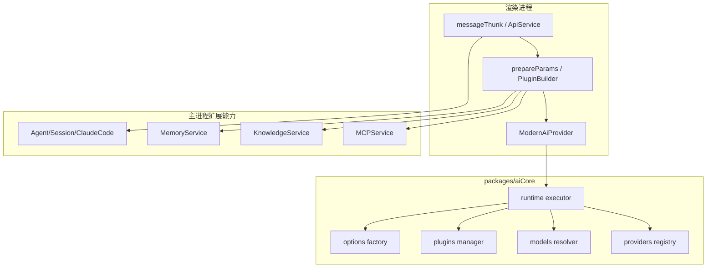

# 01-AI总体架构与分层

本项目的 AI 能力不是单层实现，而是“执行内核 + 产品编排 + 主进程扩展能力”三层协作：

- 执行内核层：`packages/aiCore`
- 产品编排层：`src/renderer/src/aiCore` + `src/renderer/src/services/ApiService.ts`
- 扩展能力层：主进程 `MCPService`、`KnowledgeService`、`memory/MemoryService`、`agents/*`

## 分层模型

## 第一层：aiCore 执行内核

`packages/aiCore` 的职责是“统一执行模型调用”，而不是业务编排。

核心目录：

- `core/runtime/`：统一调用入口（`streamText`、`generateText`、`generateImage`）
- `core/providers/`：Provider 注册和实例化（含 Hub 路由）
- `core/models/`：`modelId` 解析为可执行模型对象
- `core/plugins/`：插件生命周期与编排
- `core/options/`：Provider Options 组装与合并

它只关心如何执行，不关心 UI、话题、消息块、数据库、Agent 会话等业务实体。

## 第二层：渲染侧产品编排

`src/renderer/src/aiCore` 是“产品层 AI 编排”，做的是业务态适配，而不是重复造执行引擎：

- `index_new.ts`：`ModernAiProvider`，作为新链路入口
- `provider/`：把产品 Provider 配置适配到 aiCore 支持的 Provider ID 与参数
- `prepareParams/`：把对话消息、文件、模型能力转换为 AI SDK 参数
- `plugins/`：产品级插件编排（搜索、思考提取、兼容修复、Telemetry 等）
- `chunk/`：把 AI SDK 事件转换成 UI 可消费的 `Chunk`

这层直接承接产品特性：MCP 模式、工具可见性、Web 搜索策略、模型兼容策略、UI 流式体验。

## 第三层：主进程扩展能力

主进程提供跨会话、跨窗口、跨数据源能力：

- `MCPService.ts`：MCP Server 生命周期、`listTools/callTool`、OAuth、日志、缓存
- `KnowledgeService.ts`：RAG 知识库构建与检索
- `memory/MemoryService.ts`：长期记忆存储、向量检索、去重与历史记录
- `agents/services/*`：Agent/Session 持久化和 Claude Code 会话执行

这些能力通过 IPC 暴露给渲染层，避免在前端直接持有系统级资源和敏感凭据。

## 为什么要这样分层

如果把全部逻辑都写在页面层，会有四类问题：

1. Provider 与模型差异会污染业务代码。
2. 工具调用、搜索、知识记忆无法复用。
3. Trace/日志/异常处理无法统一沉淀。
4. Agent 与普通对话的链路难以并存。

当前分层使“执行能力”与“产品策略”可独立演进。

