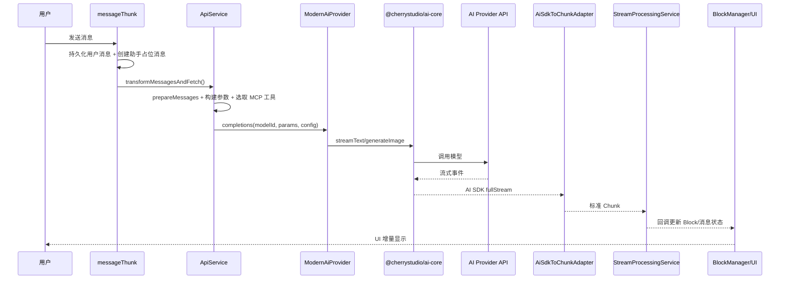

# 02-一次聊天请求的完整链路

本章描述“用户发送一条消息”后，在当前架构下的主路径。重点关注普通助手链路，同时标注 Agent 与多模型分支。

## 端到端时序

## 阶段 1：请求进入与消息落库

入口：`src/renderer/src/store/thunk/messageThunk.ts`

核心动作：

1. 保存用户消息和块数据到本地数据库。
2. 向 Redux 写入用户消息。
3. 创建助手消息占位（用于流式增量填充）。
4. 将请求放入话题队列，避免同一话题并发写冲突。

该文件已标记 v2 迁移中，新增能力原则上不应在此扩展，但它仍是当前生产链路关键入口。

## 阶段 2：业务编排与参数准备

入口：`src/renderer/src/services/ApiService.ts`

关键步骤：

1. `ConversationService.prepareMessagesForModel` 转换消息为模型可用格式。
2. 注入 Prompt 变量（动态变量替换）。
3. 按助手配置计算 MCP 模式并拉取可用工具。
4. `buildStreamTextParams` 构建 AI SDK 参数（消息、工具、模型能力、请求选项）。
5. 初始化 `ModernAiProvider` 并启动调用。

在这个阶段，业务配置会被折叠成执行配置，例如：

- 是否启用工具调用（原生或 Prompt 模拟）
- 是否启用 Web 搜索
- 是否走图像生成端点
- 是否启用 Trace 与 developer mode 行为

## 阶段 3：执行器与 Provider 调用

入口：`src/renderer/src/aiCore/index_new.ts` 与 `packages/aiCore/src/core/runtime/executor.ts`

关键动作：

1. Provider 适配（API host、auth、特殊提供商预处理）。
2. 构建插件链（`buildPlugins`）。
3. 选择 `streamText` 或图像分支。
4. 由 `RuntimeExecutor` 调用 AI SDK 原生 `streamText/generateText/generateImage`。

`RuntimeExecutor` 自身不处理 UI 语义，它只处理：

- 模型解析（字符串 modelId -> 具体模型对象）
- 插件生命周期
- 调用异常封装

## 阶段 4：流式事件转换与 UI 更新

入口：

- `src/renderer/src/aiCore/chunk/AiSdkToChunkAdapter.ts`
- `src/renderer/src/services/StreamProcessingService.ts`

流程：

1. `AiSdkToChunkAdapter` 读取 AI SDK `fullStream`，转换为统一 `ChunkType`。
2. `StreamProcessingService` 根据 `ChunkType` 分发回调。
3. 回调通过 `BlockManager` 创建/更新文本块、思考块、工具块、引用块、图片块。
4. 最终将助手消息标记为完成或失败。

这一步把“模型协议细节”与“UI 呈现语义”彻底隔离。

## 关键分支

### 分支 A：Agent 会话模式

- 入口仍在 `messageThunk`，但调用 `createAgentMessageStream` 路径。
- 会话状态由 `agentSessionId` 串联。
- 主执行逻辑进入主进程 `agents/services/*` 与 Claude Code 适配层。

### 分支 B：多模型响应模式

- 用户消息提及多个模型时，会生成多条助手占位消息。
- 每个模型作为独立任务进入队列执行。

### 分支 C：图像生成

- `ModernAiProvider` 在特定端点下可能回退 legacy 图像链路，以支持编辑等特性。

## 失败与终止处理

- 用户取消：`AbortController` + `abortCompletion`，适配器识别 abort 并避免重复报错。
- Provider 异常：转换为 `ChunkType.ERROR`，由流处理器统一落到 UI。
- 插件异常：在插件生命周期抛出后进入统一错误处理逻辑。

## 本章相关源码

- `src/renderer/src/store/thunk/messageThunk.ts`
- `src/renderer/src/services/ApiService.ts`
- `src/renderer/src/aiCore/index_new.ts`
- `packages/aiCore/src/core/runtime/executor.ts`
- `src/renderer/src/aiCore/chunk/AiSdkToChunkAdapter.ts`
- `src/renderer/src/services/StreamProcessingService.ts`

