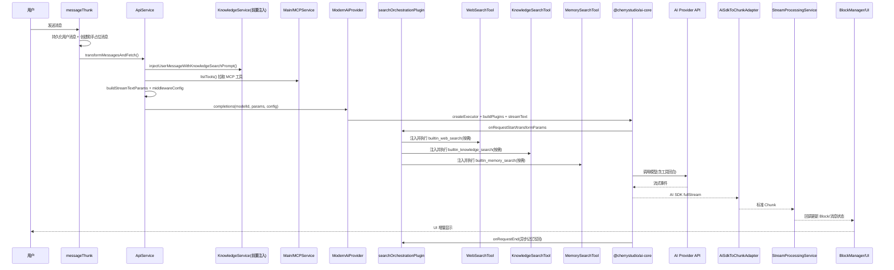

# 02-一次聊天请求的完整链路

本章描述“用户发送一条消息”后，从渲染层到 aiCore，再到工具、知识库、长期记忆的完整调用路径。

为便于理解，全文使用同一个示例：

- 用户问题：`python如今是什么版本了，该怎么学`

> 说明：文中的参数是“字段级示例”，用于帮助建立心智模型，不代表线上实际值会完全一致（例如 ID、token、时间戳、温度等）。

## 端到端时序



## 示例前置配置（同一轮请求）

示例助手配置（简化）：

```json
{
  "assistantId": "asst_python_tutor",
  "model": { "id": "openai|gpt-4.1", "provider": "openai", "name": "GPT-4.1" },
  "settings": {
    "streamOutput": true,
    "toolUseMode": "function",
    "reasoning_effort": "medium",
    "enableMaxToolCalls": true,
    "maxToolCalls": 8
  },
  "webSearchProviderId": "tavily",
  "knowledge_bases": [{ "id": "kb_python_learning" }],
  "knowledgeRecognition": "on",
  "enableMemory": true,
  "enableWebSearch": true,
  "enableUrlContext": false
}
```

## 阶段 1：请求进入与消息落库（messageThunk）

入口：`src/renderer/src/store/thunk/messageThunk.ts`

核心动作：

1. 保存用户消息和块数据到本地数据库。
2. 向 Redux 写入用户消息。
3. 创建助手消息占位（用于流式增量填充）。
4. 将请求放入话题队列，避免同一话题并发写冲突。

示例请求入参（简化）：

```json
{
  "topicId": "topic_001",
  "assistantMsgId": "msg_asst_1001",
  "messages": [
    {
      "id": "msg_user_1001",
      "role": "user",
      "content": "python如今是什么版本了，该怎么学"
    }
  ]
}
```

## 阶段 2：业务编排（ApiService）

入口：`src/renderer/src/services/ApiService.ts`

关键步骤：

1. `ConversationService.prepareMessagesForModel` 转换消息为模型可用格式。
2. `replacePromptVariables` 注入系统提示词变量。
3. `injectUserMessageWithKnowledgeSearchPrompt`（有知识库时）前置检索并写入引用提示。
4. `fetchMcpTools` 拉取 MCP 工具（`window.api.mcp.listTools`）。
5. `buildStreamTextParams` 构建 AI SDK 参数。
6. 组装 `middlewareConfig` 并调用 `AI.completions`。

### 2.1 前置知识库注入示例

`injectUserMessageWithKnowledgeSearchPrompt` 会在请求发送前执行一次知识检索，并把引用拼入最后一条用户消息。

示例（简化）：

```json
{
  "extractResults": {
    "knowledge": {
      "question": ["python如今是什么版本了，该怎么学"],
      "rewrite": ""
    }
  },
  "knowledgeBaseIds": ["kb_python_learning"],
  "topicId": "topic_001"
}
```

返回后会把用户消息改写为带引用的 `REFERENCE_PROMPT` 文本。

### 2.2 MCP 工具拉取示例

示例（简化）：

```json
{
  "mcpMode": "auto",
  "enabledMcpServers": ["hub", "local_devtools"],
  "mcpTools": [
    { "id": "hub__invoke", "name": "invoke", "serverId": "hub" },
    { "id": "local_devtools__fetch_docs", "name": "fetch_docs", "serverId": "local_devtools" }
  ]
}
```

## 阶段 3：参数构建（buildStreamTextParams）

入口：`src/renderer/src/aiCore/prepareParams/parameterBuilder.ts`

该阶段把“产品配置”折叠为“执行参数 + 能力开关”。

示例返回值（简化）：

```json
{
  "modelId": "openai|gpt-4.1",
  "capabilities": {
    "enableReasoning": true,
    "enableWebSearch": false,
    "enableGenerateImage": false,
    "enableUrlContext": false
  },
  "params": {
    "messages": [
      { "role": "user", "content": "<<<带知识引用的prompt文本>>>" }
    ],
    "maxOutputTokens": 4096,
    "temperature": 0.7,
    "topP": 1,
    "maxRetries": 0,
    "tools": {
      "hub__invoke": { "description": "Tool from hub", "inputSchema": "{...}" },
      "local_devtools__fetch_docs": { "description": "Tool from local_devtools", "inputSchema": "{...}" }
    },
    "stopWhen": "stepCountIs(8)",
    "system": "你是一个编程学习助手..."
  }
}
```

说明：

- `params.tools` 此时主要是 MCP 工具。
- `builtin_web_search / builtin_knowledge_search / builtin_memory_search` 是后续插件阶段动态注入。
- 若 `mcpMode=auto`，会追加 hub 模式 system prompt。

## 阶段 4：中间件配置（middlewareConfig）

`ApiService.fetchChatCompletion` 会构建 `AiSdkMiddlewareConfig`，决定插件策略。

示例（简化）：

```json
{
  "streamOutput": true,
  "enableReasoning": true,
  "isPromptToolUse": false,
  "isSupportedToolUse": true,
  "enableWebSearch": false,
  "enableGenerateImage": false,
  "enableUrlContext": false,
  "mcpMode": "auto",
  "knowledgeRecognition": "on",
  "mcpToolsCount": 2,
  "uiMessagesCount": 1
}
```

## 阶段 5：执行器与插件装配（AiProvider -> aiCore）

入口：

- `src/renderer/src/aiCore/AiProvider.ts`
- `src/renderer/src/aiCore/plugins/PluginBuilder.ts`
- `packages/aiCore/src/core/runtime/executor.ts`

关键动作：

1. `buildPlugins` 按配置装配插件。
2. `createExecutor` 创建 aiCore 执行器。
3. 统一走 `executor.streamText(...)`（文本链路）。

示例插件序列（可能）：

```text
pdf-compatibility
search-orchestration
prompt-tool-use(仅不支持原生函数调用时)
telemetry(开发者模式下)
...其他 provider 兼容插件
```

## 阶段 6：搜索编排插件注入工具（searchOrchestrationPlugin）

入口：`src/renderer/src/aiCore/plugins/searchOrchestrationPlugin.ts`

生命周期：

1. `onRequestStart`：意图分析（`generateText + XML 解析`）
2. `transformParams`：注入内置工具
3. `onRequestEnd`：异步记忆写回

### 6.1 意图分析示例

针对问题 `python如今是什么版本了，该怎么学`，示例分析结果：

```json
{
  "websearch": {
    "question": ["Python latest stable version", "Python release notes", "Python 学习路线"],
    "links": []
  },
  "knowledge": {
    "question": ["Python 学习路线", "Python 入门到项目实践"],
    "rewrite": "面向初学者的 Python 版本选择与学习路径"
  }
}
```

### 6.2 动态注入工具示例

在 `transformParams` 阶段，`params.tools` 可能被扩展为：

```json
{
  "hub__invoke": "{MCP tool}",
  "local_devtools__fetch_docs": "{MCP tool}",
  "builtin_web_search": "{tool(additionalContext?)}",
  "builtin_knowledge_search": "{tool(additionalContext?)}",
  "builtin_memory_search": "{tool(query, limit)}"
}
```

## 阶段 7：工具执行（Web/知识库/记忆/MCP）

### 7.1 Web 搜索工具

`builtin_web_search.execute({ additionalContext })` 内部调用：

- `WebSearchService.processWebsearch(provider, extractResults, requestId)`

示例执行参数：

```json
{
  "providerId": "tavily",
  "extractResults": {
    "websearch": {
      "question": ["Python latest stable version", "Python release notes"],
      "links": []
    }
  },
  "requestId": "req_abc123"
}
```

### 7.2 知识库工具

`builtin_knowledge_search.execute({ additionalContext })` 内部调用：

- `processKnowledgeSearch(extractResults, knowledgeBaseIds, topicId)`

示例执行参数：

```json
{
  "extractResults": {
    "knowledge": {
      "question": ["Python 学习路线", "Python 入门到项目实践"],
      "rewrite": "面向初学者的 Python 版本选择与学习路径"
    }
  },
  "knowledgeBaseIds": ["kb_python_learning"],
  "topicId": "topic_001"
}
```

### 7.3 长期记忆工具

`builtin_memory_search.execute({ query, limit })` 内部调用：

- `MemoryProcessor.searchRelevantMemories(query, processorConfig, limit)`

示例执行参数：

```json
{
  "query": "python 学习偏好、学习阶段、曾经的学习计划",
  "limit": 5,
  "processorConfig": {
    "assistantId": "asst_python_tutor",
    "userId": "user_001"
  }
}
```

### 7.4 MCP 工具

MCP 工具由 `convertMcpToolsToAiSdkTools` 包装，执行时会：

1. 判断是否需用户确认
2. 通过 `callMCPTool` 调主进程 `MCPService.callTool`

示例：

```json
{
  "toolId": "local_devtools__fetch_docs",
  "toolCallId": "toolcall_01",
  "arguments": {
    "query": "Python 3.13 changelog",
    "limit": 3
  }
}
```

## 阶段 8：Provider 调用与流式事件

`executor.streamText({ ...params, model })` 触发模型调用。

常见事件序列（简化）：

```text
text-start
text-delta
tool-input-start
tool-input-delta
tool-call
tool-result
text-delta
finish
```

## 阶段 9：Chunk 适配与 UI 回写

入口：

- `src/renderer/src/aiCore/chunk/AiSdkToChunkAdapter.ts`
- `src/renderer/src/services/StreamProcessingService.ts`

示例 Chunk 序列（简化）：

```json
[
  { "type": "TEXT_START" },
  { "type": "TEXT_DELTA", "text": "Python 当前稳定版本是 ..." },
  { "type": "MCP_TOOL_PENDING", "toolName": "builtin_web_search" },
  { "type": "MCP_TOOL_COMPLETE", "toolName": "builtin_web_search" },
  { "type": "TEXT_DELTA", "text": "学习建议可以分 4 个阶段 ..." },
  { "type": "BLOCK_COMPLETE", "response": { "usage": { "promptTokens": 1200, "completionTokens": 350 } } }
]
```

`StreamProcessingService` 再把这些事件分发到 `BlockManager`，最终表现为：

- 文本块实时增长
- 工具块显示“调用中 -> 完成”
- 引用块显示知识/网页来源
- 消息状态从 streaming -> success/fail

## 阶段 10：请求结束后的记忆写回

`searchOrchestrationPlugin.onRequestEnd` 会异步执行：

1. 从本轮 user/assistant 消息抽取事实（`MemoryProcessor.extractFacts`）
2. 对比历史记忆执行 `ADD/UPDATE/DELETE`
3. 持久化到主进程 memory DB

示例抽取结果（可能）：

```json
{
  "facts": [
    "用户正在学习 Python，关注最新版本信息",
    "用户希望获得结构化学习路径"
  ],
  "operations": [
    { "action": "ADD", "memory": "用户希望获得结构化学习路径" }
  ]
}
```

该步骤是后台异步，不阻塞当前回答返回。

## 阶段 11：下一轮如何用到这次记忆

假设下一轮用户问：`那你给我做一个4周计划`

链路中 `builtin_memory_search` 可能召回刚写入的偏好，示例：

```json
{
  "query": "4周计划 结构化 学习路径",
  "memoryHits": [
    { "memory": "用户希望获得结构化学习路径", "score": 0.91 }
  ]
}
```

模型据此会给出更贴合用户偏好的计划，而不是每轮都从零开始。

## 关键分支与回退

### 分支 A：Agent 会话模式

- 入口仍在 `messageThunk`，但调用 `createAgentMessageStream` 路径。
- 会话状态由 `agentSessionId` 串联。
- 主执行逻辑进入主进程 `agents/services/*` 与 Claude Code 适配层。

### 分支 B：多模型响应模式

- 用户消息提及多个模型时，会生成多条助手占位消息。
- 每个模型作为独立任务进入队列执行。

### 分支 C：图像生成

- `ModernAiProvider` 在特定端点下可能回退 legacy 图像链路，以支持编辑等特性。

## 失败与终止处理（按层定位）

- 用户取消：`AbortController` + `abortCompletion`，适配器识别 abort 并避免重复报错。
- Provider 异常：转换为 `ChunkType.ERROR`，由流处理器统一落到 UI。
- 插件异常：在插件生命周期抛出后进入统一错误处理逻辑。
- 工具失败：`tool-error` -> 工具块错误态，但主回答可按策略继续。
- 记忆写回失败：仅记录日志，不影响本轮主回答。

## 本章相关源码

- `src/renderer/src/store/thunk/messageThunk.ts`
- `src/renderer/src/services/ApiService.ts`
- `src/renderer/src/services/KnowledgeService.ts`
- `src/renderer/src/services/MemoryProcessor.ts`
- `src/renderer/src/aiCore/index_new.ts`
- `src/renderer/src/aiCore/AiProvider.ts`
- `src/renderer/src/aiCore/plugins/PluginBuilder.ts`
- `src/renderer/src/aiCore/plugins/searchOrchestrationPlugin.ts`
- `src/renderer/src/aiCore/tools/WebSearchTool.ts`
- `src/renderer/src/aiCore/tools/KnowledgeSearchTool.ts`
- `src/renderer/src/aiCore/tools/MemorySearchTool.ts`
- `packages/aiCore/src/core/runtime/executor.ts`
- `src/renderer/src/aiCore/chunk/AiSdkToChunkAdapter.ts`
- `src/renderer/src/services/StreamProcessingService.ts`
- `src/main/services/MCPService.ts`
- `src/main/services/memory/MemoryService.ts`
