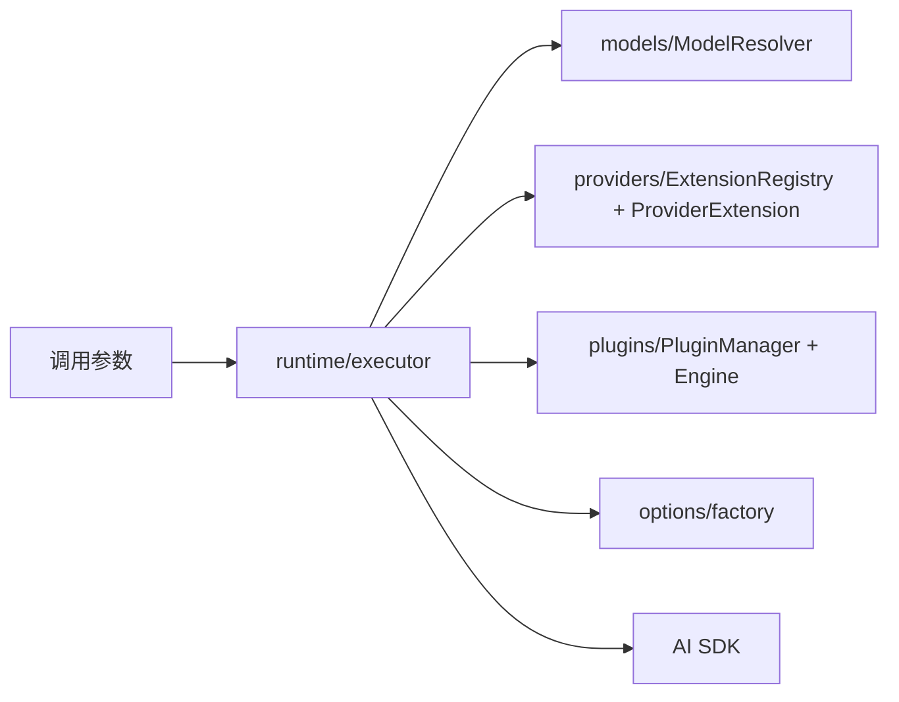

# 03-aiCore执行引擎详解

`@cherrystudio/ai-core` 是 Cherry Studio 的统一 AI 执行内核，负责“如何调用模型”，不负责“产品业务如何编排”。

## 模块职责图



## 1. runtime：统一执行入口

入口文件：

- `packages/aiCore/src/core/runtime/index.ts`
- `packages/aiCore/src/core/runtime/executor.ts`

导出能力：

- `createExecutor`
- `createOpenAICompatibleExecutor`
- `streamText`
- `generateText`
- `generateImage`
- `embedMany`

`RuntimeExecutor` 关键特性：

1. 支持字符串模型 ID 和模型对象两种输入。
2. 自动注入内部插件（模型解析、上下文配置）。
3. 将插件执行与 AI SDK 原生调用整合为统一流程。
4. 文本、图像请求走统一生命周期，但图像模型会单独走图像模型解析与错误封装。
5. 支持 `embedMany` 批量嵌入，通过 `registry.embeddingModel()` 解析模型，无需单独的 chat completion 流程。
6. `createOpenAICompatibleExecutor` 提供 OpenAI 兼容 provider 的快速创建路径，跳过通用 `createExecutor` 的 providerId 解析步骤，直接创建优化后的执行器。

## 2. models：模型类型与版本守卫

入口文件：`packages/aiCore/src/core/models/`

当前模块已简化为模型类型守卫与配置类型：

- `types.ts`：`ModelConfig<T, TSettingsMap>` 泛型接口，定义模型与 provider 设置的关联
- `utils.ts`：`hasModelId()`、`isV2Model()`、`isV3Model()` 类型守卫函数
- `index.ts`：导出上述类型和守卫

**注意**：旧版 `ModelResolver` 类已不再作为独立模块存在。模型解析职责已收敛到 Provider Extension 的 `resolveModel` 钩子和 `RuntimeExecutor.resolveModel()` 方法中。Executor 内部通过 `extensionRegistry.getModelResolver()` 获取 variant 级别的解析函数，或使用 AI SDK 注册表作为 fallback。

当前内核侧实际覆盖的模型类型包括：

- **Language Model** — 文本聊天/补全，通过 `streamText`/`generateText` 执行，涉及 messages、tools、reasoning、finish reason、usage 等语义
- **Image Model** — 图像生成/编辑，通过 `generateImage` 执行，涉及提示词、尺寸/质量、URL/Base64 图像结果
- **Embedding Model** — 文本向量化，通过 `embedMany` 执行，输入文本数组输出向量数组，用于知识库记忆系统的向量检索
- **Reranking Model** — 搜索重排序，运行在知识库系统的重排器层，对初步搜索结果进行二次排序
- **Speech Model** — 语音合成，将文本转换为语音输出
- **Transcription Model** — 语音识别，将音频输入转录为文本

注意：当前 aiCore 核心包只直接支持 Language、Image、Embedding 三种模型类型的执行（streamText/generateText、generateImage、embedMany），Reranking、Speech、Transcription 的协议适配主要由渲染层编排和主进程知识库/语音服务完成。

典型解析规则：

- 传统：`gpt-4` + fallback provider -> `openai|gpt-4`
- 命名空间：`provider|modelId` 直接解析
- Hub：`hubId` 作为 provider 注册后，`hubId|provider|modelId` 由 Hub Provider 再分发

注意：

- 当前 `RegistryManagement` 使用 `|` 作为统一分隔符，而不是 `:`。
- 这样做是为了避免和 provider 内部 suffix、兼容 API 标识冲突。

## 3. providers：基于 Extension 的注册体系

核心文件：

- `packages/aiCore/src/core/providers/core/ExtensionRegistry.ts` — 扩展注册中心与全局单例
- `packages/aiCore/src/core/providers/core/ProviderExtension.ts` — Provider 实例化与 LRU 缓存
- `packages/aiCore/src/core/providers/core/initialization.ts` — 内核级 Provider Extension 定义与自动注册

核心能力：

1. **Extension 注册**：每个 Extension 声明式定义 `baseId`、`aliases`、`variants`、`toolFactories`。模块加载时自动注册。
2. **ProviderExtension 实例化**：LRU 缓存（max 10）+ pending promise map 防止并发重复创建。支持 `create` 函数和动态 `import` + `creatorFunctionName` 两种模式。
3. **Variant 机制**：同一 Provider 可声明多个 variant（如 `openai-chat`、`openai-responses`、`azure-anthropic`），每个 variant 有独立的 `resolveModel` 函数和 `transform` 配置。
4. **ToolFactory 机制**：Provider 可声明 `webSearch`、`urlContext`、`codeExecution`、`fileSearch` 等能力，通过 `resolveToolCapability()` 解析，支持 aggregator fallback。
5. **alias 管理**：支持别名注册、真实 ID 反查。`parseProviderId()` 解析完整 ID 如 `openai-chat` 为 `{baseId: 'openai', mode: 'chat', isVariant: true}`。

当前 `initialization.ts` 负责注册 9 个内核级 Extension（OpenAI、Anthropic、Azure、Google、xAI、DeepSeek、OpenRouter、OpenAI Compatible、CherryIn），渲染侧还会按产品需要补充 15 个扩展（Vertex、Bedrock、Copilot、Ollama、Perplexity、Groq 等）。理解这一层时重点看”注册机制”和”variant/toolFactory 约定”，不要把某个时刻的扩展数量当成稳定契约。

示例：

| Extension | 说明 |
|-----------|------|
| `anthropic` | 支持 alias、tool factory 与模型解析 |
| `azure` | 通过 variant 区分不同托管协议 |
| `google` | 同时声明模型解析与搜索相关能力 |
| `openai` | 通过 variant 兼容不同接口形态 |
| `openai-compatible` | 承接用户自定义兼容 Provider |

渲染侧还会在 `src/renderer/src/aiCore/provider/extensions/` 注册产品层补充扩展，例如 Vertex、Bedrock、Copilot、Ollama、Perplexity、Groq 等。具体名单以当前源码为准。

**Variant 类型安全**：`ProviderVariant<TSettings, TProvider, TOutput>` 增加 `TOutput` 泛型，使 `transform` 输出类型流转到 `toolFactories` 和 `resolveModel`，修复了 azure-anthropic 的 `provider.tools.webSearchPreview is not a function` 问题（#14087）。

## 3.1 贯穿全流程示例：用户添加 DashScope（通义千问）Provider

以下例子追踪从用户在 UI 添加 Provider，到最终发起一次流式聊天的完整转化路径。每一层都展示了数据形态的变化。

### 起点：用户在 UI 填入配置

用户在设置页添加一个自定义 Provider：

```
类型: OpenAI Compatible
名称: DashScope
API Host: https://dashscope.aliyuncs.com/compatible-mode/v1
API Key: sk-abc123...
模型: qwen-max
```

对应 Redux store 中的 `Provider` 对象：

```json
{
  "id": "dashscope",
  "type": "openai",
  "name": "DashScope",
  "apiHost": "https://dashscope.aliyuncs.com/compatible-mode/v1",
  "apiKey": "sk-abc123...",
  "models": [
    { "id": "qwen-max", "name": "通义千问 Max", "provider": "openai" }
  ]
}
```

### 第一步：渲染侧 `getAiSdkProviderId()` — ID 映射

用户选择 `qwen-max` 模型发送消息。渲染侧调用 `getAiSdkProviderId(provider)`：

```typescript
// src/renderer/src/aiCore/provider/factory.ts

// provider.id = 'dashscope'，不在 appProviderIds 中
// provider.type = 'openai'，不在 appProviderIds 中
// apiHost 不包含 'api.openai.com'
// → 返回 provider.id = 'dashscope'
```

因为 `dashscope` 不在预注册列表中，返回原始 ID。但 `provider.type = 'openai'` 标记了它使用 OpenAI 兼容协议。

### 第二步：渲染侧 `providerToAiSdkConfig()` — 配置转换

```typescript
// src/renderer/src/aiCore/provider/providerConfig.ts

const config: ProviderConfig = {
  providerId: 'openai-compatible',     // type='openai' 但不是官方域名 → 走 openai-compatible
  providerSettings: {
    name: 'dashscope',
    apiKey: 'sk-abc123...',
    baseURL: 'https://dashscope.aliyuncs.com/compatible-mode/v1',
    headers: { 'X-Client': 'CherryStudio' }
  }
}
```

关键转化：

- `provider.id`（`dashscope`）→ `providerId`（`openai-compatible`）
- `provider.apiHost` → `providerSettings.baseURL`
- `provider.apiKey` → `providerSettings.apiKey`

### 第三步：`AiProvider` 构造 — 适配与延迟初始化

```typescript
// src/renderer/src/aiCore/AiProvider.ts

const model = { id: 'qwen-max', name: '通义千问 Max', provider: 'openai' }
const ai = new AiProvider(model)

// 内部执行：
// 1. getActualProvider(model) → 从 store 获取完整的 Provider 对象
// 2. adaptProvider({ provider, model }) → 克隆并格式化 API Host
// 3. providerToAiSdkConfig() → 得到上面的 ProviderConfig
// 4. config 可能是同步值或 Promise，先缓存
```

此时 `AiProvider` 只是持有配置，**还没有创建 AI SDK 实例**。创建是延迟的。

### 第四步：`ApiService` → `buildStreamTextParams()` — 参数构建

用户发送消息 `"你好"` 后，`ApiService.fetchChatCompletion()` 构建 AI SDK 参数：

```typescript
// src/renderer/src/aiCore/prepareParams/parameterBuilder.ts

const params = {
  messages: [
    { role: 'user', content: '你好' }
  ],
  maxOutputTokens: 4096,
  temperature: 0.7,
  topP: 1,
  maxRetries: 0,
  tools: { /* MCP 工具 */ },
  stopWhen: 'stepCountIs(8)'
}

const middlewareConfig = {
  streamOutput: true,
  enableWebSearch: false,
  isSupportedToolUse: true,
  isPromptToolUse: false,
  mcpTools: [/* ... */],
  topicId: 'topic_001',
  assistant: { /* 完整助手配置 */ }
}
```

### 第五步：`AiProvider.modernCompletions()` — 插件装配

```typescript
// src/renderer/src/aiCore/AiProvider.ts

const plugins = buildPlugins({
  provider: this.actualProvider,  // DashScope Provider
  model: this.model,              // qwen-max
  config: middlewareConfig
})

// 对于 openai-compatible + qwen-max，PluginBuilder 会装配：
// 1. PdfCompatibilityPlugin（始终启用）
// 2. ReasoningExtractionPlugin（provider type = openai，提取 <thinking> 标签）
// 3. SearchOrchestrationPlugin（isSupportedToolUse = true）
// 可能还有 QwenThinkingPlugin（如果是 Qwen3 模型且 provider 不支持 enable_thinking）
```

### 第六步：`createExecutor()` — 进入 aiCore

```typescript
// packages/aiCore/src/core/runtime/executor.ts
// 调用方：AiProvider.modernCompletions()

const executor = await createExecutor<AppProviderSettingsMap>(
  'openai-compatible',                              // providerId
  {                                                  // providerSettings
    name: 'dashscope',
    apiKey: 'sk-abc123...',
    baseURL: 'https://dashscope.aliyuncs.com/compatible-mode/v1',
    headers: { 'X-Client': 'CherryStudio' }
  },
  plugins  // 上一步构建的插件数组
)
```

**`createExecutor` 内部做了什么**：

```typescript
// 1. 从 extensionRegistry 获取 Extension
const extension = extensionRegistry.get('openai-compatible')
// → 找到 OpenAICompatibleExtension

// 2. 创建 PluginEngine
const engine = new PluginEngine(providerId, plugins)

// 3. 创建 RuntimeExecutor，内部持有 engine
const executor = new RuntimeExecutor(providerSettings, engine)

// 4. 返回 executor，此时仍未创建 AI SDK Provider 实例
```

### 第七步：`executor.streamText()` — 插件生命周期触发

```typescript
const streamResult = await executor.streamText({
  ...params,           // messages, temperature, tools, etc.
  model: 'qwen-max',
  experimental_context: { onChunk: middlewareConfig.onChunk }
})
```

**`streamText()` 内部的插件执行流程**：

```
1. PluginEngine.executeStreamWithPlugins()
   │
   ├─ configureContext  → 所有插件依次配置上下文
   │   └─ telemetryPlugin 注入 tracer
   │   └─ searchOrchestrationPlugin 注入 metadata
   │
   ├─ onRequestStart    → 并行执行
   │   └─ telemetryPlugin 创建 OpenTelemetry span
   │   └─ searchOrchestrationPlugin 发起意图分析（轻量 generateText）
   │
   ├─ resolveModel      → First 策略
   │   └─ 默认解析：extensionRegistry.get('openai-compatible')
   │      → createOpenAICompatible({ baseURL, apiKey, headers })
   │      → 返回 OpenAICompatibleProvider 实例（写入 LRU cache）
   │
   ├─ transformParams   → 链式合并
   │   └─ searchOrchestrationPlugin 注入 builtin_web_search 等工具
   │
   ├─ transformStream   → 收集所有 TransformStream
   │   └─ promptToolUsePlugin 的工具调用流处理器（如果启用）
   │
   ├─ [AI SDK streamText()]  ← 实际发起 HTTP 请求
   │   POST https://dashscope.aliyuncs.com/compatible-mode/v1/chat/completions
   │   {
   │     model: "qwen-max",
   │     messages: [{ role: "user", content: "你好" }],
   │     stream: true,
   │     temperature: 0.7,
   │     ...
   │   }
   │
   └─ onRequestEnd      → 并行执行（流结束后）
       └─ searchOrchestrationPlugin 触发记忆写回
       └─ telemetryPlugin 结束 span
```

### 第八步：Provider 实例化的细节

`resolveModel` 阶段，`OpenAICompatibleExtension` 被触发：

```typescript
// packages/aiCore/src/core/providers/core/initialization.ts

const OpenAICompatibleExtension = ProviderExtension.create({
  name: 'openai-compatible',
  create: (settings) => {
    if (!settings) {
      throw new Error('OpenAI Compatible provider requires settings')
    }
    return createOpenAICompatible(settings)
  }
})
```

`ProviderExtension.createProvider()` 的执行：

```typescript
// 1. 合并 settings：defaultOptions ∪ 传入的 settings
const mergedSettings = deepMergeObjects({}, {
  name: 'dashscope',
  apiKey: 'sk-abc123...',
  baseURL: 'https://dashscope.aliyuncs.com/compatible-mode/v1',
  headers: { 'X-Client': 'CherryStudio' }
})

// 2. 计算稳定 hash
const hash = stableStringify(mergedSettings)
// → '{"apiKey":"sk-abc123...","baseURL":"...","headers":{"X-Client":"CherryStudio"},"name":"dashscope"}'

// 3. 查 LRU cache → 未命中（首次）

// 4. 调 create 函数
const provider = createOpenAICompatible(mergedSettings)
// → 返回 OpenAICompatibleProvider 实例

// 5. 写入 LRU cache
this.instances.set(hash, provider)
```

下次相同配置调用时，直接从 LRU cache 返回，不重复创建。

### 第九步：AI SDK 返回流 → Chunk 适配

DashScope 返回 SSE 流：

```
data: {"id":"chat-001","choices":[{"delta":{"role":"assistant"},"index":0}]}
data: {"id":"chat-001","choices":[{"delta":{"content":"你"},"index":0}]}
data: {"id":"chat-001","choices":[{"delta":{"content":"好"},"index":0}]}
data: {"id":"chat-001","choices":[{"finish_reason":"stop"}]}
```

AI SDK 将其转为 `fullStream`（ReadableStream of TextStreamPart）：

```
{ type: 'text-start' }
{ type: 'text-delta', text: '你' }
{ type: 'text-delta', text: '好' }
{ type: 'text-end', finishReason: 'stop', usage: { totalTokens: 50, ... } }
{ type: 'finish', finishReason: 'stop' }
```

`AiSdkToChunkAdapter` 转换为 Cherry Studio Chunk：

```
{ type: 'TEXT_START' }
{ type: 'TEXT_DELTA', text: '你' }
{ type: 'TEXT_DELTA', text: '好' }
{ type: 'TEXT_COMPLETE' }
{ type: 'BLOCK_COMPLETE', response: { usage: { promptTokens: 30, completionTokens: 20 } } }
```

`StreamProcessingService` 分发到 UI，用户看到"你好"增量渲染完成。

### 全流程数据变形总结

```
层                    输入                          输出
────────────────────────────────────────────────────────────────
用户填写             { 表单字段 }                   —
────────────────────────────────────────────────────────────────
Provider Object      { id, type, apiHost, apiKey }  Redux store 中的 Provider
────────────────────────────────────────────────────────────────
getAiSdkProviderId   Provider 对象                 'openai-compatible'（或原始 ID）
────────────────────────────────────────────────────────────────
providerToAiSdkConfig Provider + Model              { providerId, providerSettings }
────────────────────────────────────────────────────────────────
AiProvider 构造      providerSettings               持有配置（延迟初始化）
────────────────────────────────────────────────────────────────
buildStreamTextParams 消息 + 配置                   { messages, temperature, tools, ... }
────────────────────────────────────────────────────────────────
buildPlugins         provider + model + config      AiPlugin[] 数组
────────────────────────────────────────────────────────────────
createExecutor       providerId + settings + plugins RuntimeExecutor 实例
────────────────────────────────────────────────────────────────
resolveModel         providerSettings               OpenAICompatibleProvider（LRU 缓存）
────────────────────────────────────────────────────────────────
streamText           params + provider              AI SDK ReadableStream
────────────────────────────────────────────────────────────────
AiSdkToChunkAdapter  TextStreamPart[]               ChunkType[]
────────────────────────────────────────────────────────────────
UI 渲染              ChunkType[]                    可见文本
```

## 4. plugins：插件生命周期

核心文件：

- `packages/aiCore/src/core/plugins/manager.ts`
- `packages/aiCore/src/core/runtime/pluginEngine.ts`

插件执行语义：

- 顺序：`pre -> normal -> post`
- 钩子类型：
- `resolveModel` / `loadTemplate`（首个胜出）
- `transformParams` / `transformResult`（顺序链式）
- `onRequestStart` / `onRequestEnd` / `onError`（并行执行）
- `transformStream`（流处理，收集所有 TransformStream）
该机制是“请求编排统一扩展点”，把搜索、日志、工具调用、兼容修复都纳入同一生命周期。

| 分类 | 核心问题 | 解决方案 |
|------|----------|----------|
| First-wins | 多个插件处理同一事，谁说了算？ | 只用第一个，避免冲突 |
| Sequential | 参数需要层层加工怎么处理？ | 链式传递，累积合并 |
| Parallel | 监控/日志等副作用要同时执行？ | Promise.all 并行 |
| Collect | 多个流转换器怎么统一管理？ | 收集后一起传给 SDK |

## 5. options：Provider 参数工厂

核心文件：`packages/aiCore/src/core/options/factory.ts`

职责：

1. 创建 provider 专属 options。
2. 合并多来源 options（含深合并）。
3. 提供 typed helper（OpenAI/Anthropic/Google 等）。
4. 允许未知 provider 使用 generic options 进入统一合并链路。

这层避免参数拼接逻辑散落在调用端。

## 6. 错误模型

核心错误在 `packages/aiCore/src/core/errors/` 与 runtime errors 中定义：

| 错误类 | 触发场景 |
|--------|---------|
| `AiCoreError` | 所有 aiCore 错误的基类，提供 `toJSON()` 序列化 |
| `RecursiveDepthError` | 插件递归调用超过最大深度（默认 10） |
| `ModelResolutionError` | 模型 ID 无法解析为有效模型对象 |
| `ParameterValidationError` | 参数校验失败 |
| `PluginExecutionError` | 插件执行过程中抛出异常 |
| `ProviderConfigError` | Provider 配置缺失或格式错误 |
| `ImageGenerationError` | 图像生成失败 |
| `TemplateLoadError` | 提示词模板加载失败 |

作用是把底层异常转换为可诊断、可观测、可归因的错误类型。

## 7. 与渲染侧的边界

`ai-core` 不负责：

- UI 消息块结构
- Redux 状态写入
- IPC 调用主进程服务
- Agent 会话状态管理

这些由渲染层编排与主进程服务负责。`ai-core` 只处理“执行层正确性与可扩展性”。

## 8. AI SDK 协议标准整理

`@cherrystudio/ai-core` 的一个核心价值，是把不同厂商、不同模型类型、不同流式事件格式，收敛为一套相对稳定的 AI SDK 调用协议。

这层标准化不是“定义行业标准”，而是为 Cherry Studio 建立统一执行面，使上层编排和 UI 不需要直接面向 OpenAI、Anthropic、Google 等供应商的原生协议细节。

### 8.1 统一输入协议

在文本模型场景中，执行层主要围绕 AI SDK 的统一参数组织请求，典型包含：

- `model`
- `messages`
- `system`
- `tools`
- `toolChoice`
- `responseFormat`
- `stream`

这些字段的价值在于：

1. 上层产品只需要表达“我要什么能力”，而不是自己拼各家 Provider 的 HTTP Body。
2. 参数兼容和字段翻译集中在 Provider 与 options 层处理。
3. 插件可以稳定地在 `transformParams`、`configureContext` 等生命周期中介入，而不必感知底层厂商差异。

例如：

- OpenAI 兼容链路通常围绕 `messages`、`tools`、`response_format` 组织。
- Anthropic 会有自己对工具选择、thinking、metadata 的表达方式。
- Google/Gemini 在原生协议里常见的是 `contents`、`parts`、安全设置等结构。

但在 Cherry Studio 中，上层编排尽量先落到统一 AI SDK 参数，再由 Provider 适配层完成下游翻译。

### 8.2 统一输出协议

统一执行层向上游暴露的，不应是某一家模型的原始响应包，而是归一后的结果语义。核心包括：

- 文本内容 `text`
- 推理内容 `reasoning`
- 工具调用 `tool-call`
- 工具结果 `tool-result`
- 结束原因 `finishReason`
- 资源消耗 `usage`

其中最关键的是两个统一面：

1. 结束语义统一  
   不同供应商对“正常结束、长度截断、触发工具调用、内容拦截”的命名不同，但在执行层会尽量收敛为统一的 `finishReason` 语义，例如 `stop`、`length`、`tool-calls`、`content-filter`。

2. 用量统计统一  
   不同供应商对 token 统计字段命名不同，但上层更关心的是：
   - `promptTokens`
   - `completionTokens`
   - `totalTokens`

这使 Trace、计费、调试、性能分析都可以在统一结构上工作，而不必为每个 Provider 写一套解析分支。

### 8.3 流式事件标准化

真正复杂的地方不在“最终响应”，而在“流式增量事件”。

AI SDK 流中常见的事件包括：

- `text-start`
- `text-delta`
- `text-end`
- reasoning 相关事件
- tool call / tool result 相关事件
- `raw`
- 最终完成事件与 usage 汇总

Cherry Studio 不直接把这些事件交给页面，而是通过渲染层的 `AiSdkToChunkAdapter` 再映射为统一 `Chunk`：

- `text-start` -> `ChunkType.TEXT_START`
- `text-delta` -> `ChunkType.TEXT_DELTA`
- `text-end` -> `ChunkType.TEXT_COMPLETE`
- reasoning 增量 -> `THINKING_START` / `THINKING_DELTA` / `THINKING_COMPLETE`
- tool call/tool result -> MCP Tool 相关 Chunk
- 最终 usage/finish reason -> `BLOCK_COMPLETE` / `LLM_RESPONSE_COMPLETE`

这样做的意义是：

1. UI 只需要消费 `Chunk` 协议，不直接依赖 AI SDK 内部事件细节。
2. 厂商事件差异、乱序、缺字段、补发 usage 等兼容逻辑，被集中在适配层处理。
3. 文本、thinking、工具调用、Web Search 都能进入统一消息块生命周期。

### 8.4 不同模型类型的协议差异

Cherry Studio 的统一执行内核不只处理聊天模型，还覆盖多种模型类型：

- Language Model
- Image Model
- Embedding Model
- Reranking Model
- Speech Model
- Transcription Model

它们共享“统一注册、统一解析、统一执行入口”的框架，但协议重点不同：

- Language Model  
  重点是 `messages`、`tools`、流式文本、reasoning、finish reason、usage。

- Image Model  
  重点是提示词、尺寸/质量等生成参数，以及 URL/Base64 等图像结果封装。

- Embedding Model  
  重点是输入文本到向量结果的稳定映射，不涉及聊天式 `messages` 协议。

- Reranking Model  
  重点是 query、候选文档列表和排序分数。

- Speech / Transcription Model  
  重点是音频输入、分片传输、文本输出以及可能的时间戳元数据。

因此，所谓“AI SDK 协议标准化”，并不是把所有模型都压成同一个字段集合，而是为每类模型定义统一的执行抽象和错误边界。

### 8.5 Provider 差异在哪一层被收敛

协议收敛不是在单一文件里完成，而是多层协作：

- `models` 层：把 `modelId` 解析成正确模型对象，确定这是 language/image/embedding 等哪一类模型。
- `providers` 层：把 Provider 注册为统一可执行实体，处理 alias、Hub 路由、实例化。
- `options` 层：把产品参数合并成各 Provider 可接受的配置。
- `plugins` 层：在统一生命周期中插入搜索、日志、兼容修复、工具调用等扩展。
- 渲染层 adapter：把 AI SDK 流事件转成 UI 可消费的 `Chunk`。

可以把它理解为：

- `ai-core` 负责把“多厂商协议”收敛成“统一执行协议”
- 渲染层负责把“统一执行协议”再转换成“产品交互协议”

### 8.6 协议边界

这套标准化边界需要明确，否则很容易把职责写乱：

1. `ai-core` 负责模型协议归一，不负责页面状态与交互细节。
2. 渲染层负责编排产品参数，如工具可见性、搜索策略、知识记忆注入、模型兼容策略。
3. 主进程负责系统资源、持久化和外部服务能力，不直接参与 UI Chunk 协议。
4. UI 层只消费统一 `Chunk` 与结果对象，不直接耦合 OpenAI、Anthropic、Google 的原生返回格式。

这就是 Cherry Studio 当前 AI 链路里“AI SDK 协议标准整理”的核心意义：不是追求抽象层数本身，而是把供应商差异隔离在可维护、可测试、可扩展的边界内。
