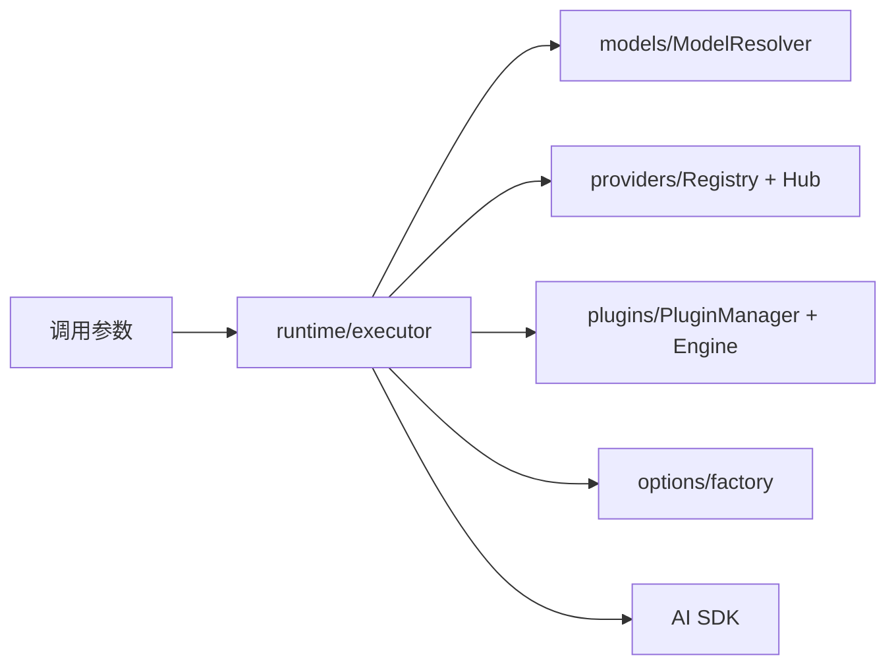

# 03-aiCore执行引擎详解

`@cherrystudio/ai-core` 是 Cherry Studio 的统一 AI 执行内核，负责“如何调用模型”，不负责“产品业务如何编排”。

## 模块职责图

## 1. runtime：统一执行入口

入口文件：

- `packages/aiCore/src/core/runtime/index.ts`
- `packages/aiCore/src/core/runtime/executor.ts`

导出能力：

- `createExecutor`
- `createOpenAICompatibleExecutor`
- `streamText`
- `generateText`
- `generateImage`

`RuntimeExecutor` 关键特性：

1. 支持字符串模型 ID 和模型对象两种输入。
2. 自动注入内部插件（模型解析、上下文配置）。
3. 将插件执行与 AI SDK 原生调用整合为统一流程。

## 2. models：模型解析

入口文件：`packages/aiCore/src/core/models/ModelResolver.ts`

核心作用：

- 把 `modelId` 解析为可执行模型对象（语言、图像、Embedding）
- 同时支持传统格式和命名空间格式

典型解析规则：

- 传统：`gpt-4` + fallback provider -> `openai:gpt-4`
- 命名空间：`provider:modelId` 直接解析
- Hub：`hubId:providerId:modelId` 由 Hub Provider 再分发

## 3. providers：Provider 注册与实例化

核心文件：

- `packages/aiCore/src/core/providers/RegistryManagement.ts`
- `packages/aiCore/src/core/providers/HubProvider.ts`

核心能力：

1. Provider 配置注册与动态实例化。
2. 通过 `wrapProvider` 统一到 V3 规格。
3. Hub 路由能力：一个 Hub 代理多个底层 Provider。

Hub 价值：

- 产品层只维护 Hub 接入点；
- 实际请求在运行时按 `provider:modelId` 路由到底层实现。

## 4. plugins：插件生命周期

核心文件：

- `packages/aiCore/src/core/plugins/manager.ts`
- `packages/aiCore/src/core/runtime/pluginEngine.ts`

插件执行语义：

- 顺序：`pre -> normal -> post`
- 钩子类型：
- `resolveModel` / `loadTemplate`（First）
- `transformParams` / `transformResult`（Sequential）
- `onRequestStart` / `onRequestEnd` / `onError`（Parallel）
- `transformStream`（流转换收集）

该机制是“请求编排统一扩展点”，把搜索、日志、工具调用、兼容修复都纳入同一生命周期。

## 5. options：Provider 参数工厂

核心文件：`packages/aiCore/src/core/options/factory.ts`

职责：

1. 创建 provider 专属 options。
2. 合并多来源 options（含深合并）。
3. 提供 typed helper（OpenAI/Anthropic/Google 等）。

这层避免参数拼接逻辑散落在调用端。

## 6. 错误模型

核心错误在 `packages/aiCore/src/core/errors/` 与 runtime errors 中定义，如：

- `ModelResolutionError`
- `ProviderConfigError`
- `PluginExecutionError`
- `ImageGenerationError`

作用是把底层异常转换为可诊断、可观测、可归因的错误类型。

## 7. 与渲染侧的边界

`ai-core` 不负责：

- UI 消息块结构
- Redux 状态写入
- IPC 调用主进程服务
- Agent 会话状态管理

这些由渲染层编排与主进程服务负责。`ai-core` 只处理“执行层正确性与可扩展性”。

