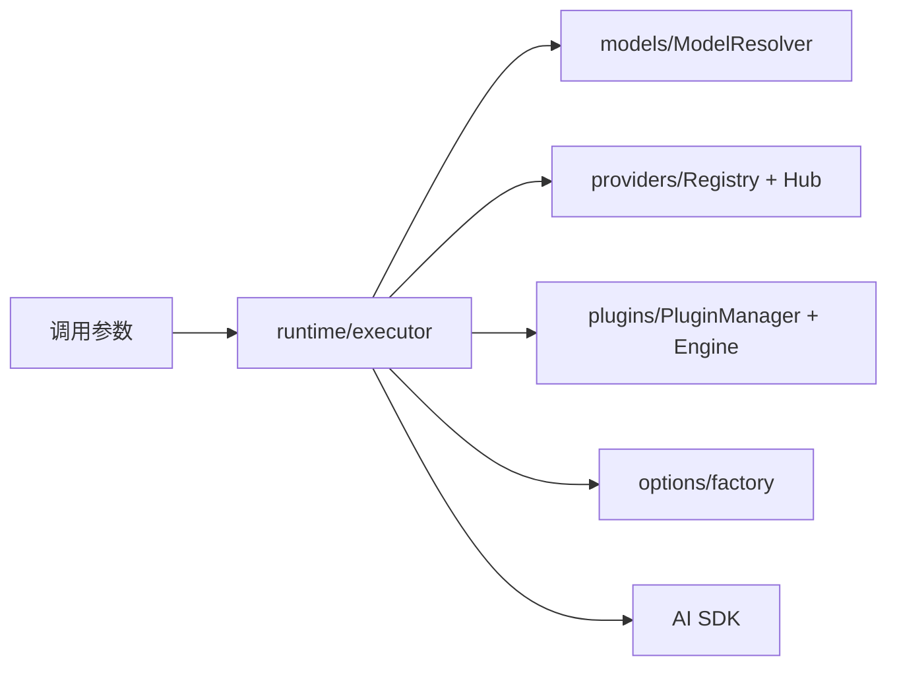

# 03-aiCore执行引擎详解

`@cherrystudio/ai-core` 是 Cherry Studio 的统一 AI 执行内核，负责“如何调用模型”，不负责“产品业务如何编排”。

## 模块职责图

## 1. runtime：统一执行入口

入口文件：

- `packages/aiCore/src/core/runtime/index.ts`
- `packages/aiCore/src/core/runtime/executor.ts`

导出能力：

- `createExecutor`
- `createOpenAICompatibleExecutor`
- `streamText`
- `generateText`
- `generateImage`

`RuntimeExecutor` 关键特性：

1. 支持字符串模型 ID 和模型对象两种输入。
2. 自动注入内部插件（模型解析、上下文配置）。
3. 将插件执行与 AI SDK 原生调用整合为统一流程。
4. 文本、图像请求走统一生命周期，但图像模型会单独走图像模型解析与错误封装。

## 2. models：模型解析

入口文件：`packages/aiCore/src/core/models/ModelResolver.ts`

核心作用：

- 把 `modelId` 解析为可执行模型对象（语言、图像、Embedding）
- 同时支持传统格式和命名空间格式
- 对 OpenAI / Azure 的 chat mode 做 provider 级模式切换

当前内核侧实际覆盖的模型类型不止聊天模型，还包括：

- Language Model
- Image Model
- Embedding Model
- Reranking Model
- Speech Model
- Transcription Model

典型解析规则：

- 传统：`gpt-4` + fallback provider -> `openai|gpt-4`
- 命名空间：`provider|modelId` 直接解析
- Hub：`hubId` 作为 provider 注册后，`hubId|provider|modelId` 由 Hub Provider 再分发

注意：

- 当前 `RegistryManagement` 使用 `|` 作为统一分隔符，而不是 `:`。
- 这样做是为了避免和 provider 内部 suffix、兼容 API 标识冲突。

## 3. providers：Provider 注册与实例化

核心文件：

- `packages/aiCore/src/core/providers/RegistryManagement.ts`
- `packages/aiCore/src/core/providers/HubProvider.ts`

核心能力：

1. Provider 配置注册与动态实例化。
2. 通过 `wrapProvider` 统一到 V3 规格。
3. Hub 路由能力：一个 Hub 代理多个底层 Provider。
4. Provider alias 管理：支持别名注册、真实 ID 反查、卸载时联动清理。
5. Provider registry 生命周期管理：注册、注销、清空、重建。

Hub 价值：

- 产品层只维护 Hub 接入点；
- 实际请求在运行时按 `provider|modelId` 路由到底层实现。

补充说明：

- Hub Provider 不只代理语言模型，也代理 embedding / image / reranking / speech / transcription。
- 因此 Hub 不只是“聊天模型聚合器”，而是更通用的模型路由层。

## 4. plugins：插件生命周期

核心文件：

- `packages/aiCore/src/core/plugins/manager.ts`
- `packages/aiCore/src/core/runtime/pluginEngine.ts`

插件执行语义：

- 顺序：`pre -> normal -> post`
- 钩子类型：
- `resolveModel` / `loadTemplate`（First）
- `transformParams` / `transformResult`（Sequential）
- `onRequestStart` / `onRequestEnd` / `onError`（Parallel）
- `transformStream`（流转换收集）

该机制是“请求编排统一扩展点”，把搜索、日志、工具调用、兼容修复都纳入同一生命周期。

## 5. options：Provider 参数工厂

核心文件：`packages/aiCore/src/core/options/factory.ts`

职责：

1. 创建 provider 专属 options。
2. 合并多来源 options（含深合并）。
3. 提供 typed helper（OpenAI/Anthropic/Google 等）。
4. 允许未知 provider 使用 generic options 进入统一合并链路。

这层避免参数拼接逻辑散落在调用端。

## 6. 错误模型

核心错误在 `packages/aiCore/src/core/errors/` 与 runtime errors 中定义，如：

- `ModelResolutionError`
- `ProviderConfigError`
- `PluginExecutionError`
- `ImageGenerationError`

作用是把底层异常转换为可诊断、可观测、可归因的错误类型。

## 7. 与渲染侧的边界

`ai-core` 不负责：

- UI 消息块结构
- Redux 状态写入
- IPC 调用主进程服务
- Agent 会话状态管理

这些由渲染层编排与主进程服务负责。`ai-core` 只处理“执行层正确性与可扩展性”。

## 8. AI SDK 协议标准整理

`@cherrystudio/ai-core` 的一个核心价值，是把不同厂商、不同模型类型、不同流式事件格式，收敛为一套相对稳定的 AI SDK 调用协议。

这层标准化不是“定义行业标准”，而是为 Cherry Studio 建立统一执行面，使上层编排和 UI 不需要直接面向 OpenAI、Anthropic、Google 等供应商的原生协议细节。

### 8.1 统一输入协议

在文本模型场景中，执行层主要围绕 AI SDK 的统一参数组织请求，典型包含：

- `model`
- `messages`
- `system`
- `tools`
- `toolChoice`
- `responseFormat`
- `stream`

这些字段的价值在于：

1. 上层产品只需要表达“我要什么能力”，而不是自己拼各家 Provider 的 HTTP Body。
2. 参数兼容和字段翻译集中在 Provider 与 options 层处理。
3. 插件可以稳定地在 `transformParams`、`configureContext` 等生命周期中介入，而不必感知底层厂商差异。

例如：

- OpenAI 兼容链路通常围绕 `messages`、`tools`、`response_format` 组织。
- Anthropic 会有自己对工具选择、thinking、metadata 的表达方式。
- Google/Gemini 在原生协议里常见的是 `contents`、`parts`、安全设置等结构。

但在 Cherry Studio 中，上层编排尽量先落到统一 AI SDK 参数，再由 Provider 适配层完成下游翻译。

### 8.2 统一输出协议

统一执行层向上游暴露的，不应是某一家模型的原始响应包，而是归一后的结果语义。核心包括：

- 文本内容 `text`
- 推理内容 `reasoning`
- 工具调用 `tool-call`
- 工具结果 `tool-result`
- 结束原因 `finishReason`
- 资源消耗 `usage`

其中最关键的是两个统一面：

1. 结束语义统一  
   不同供应商对“正常结束、长度截断、触发工具调用、内容拦截”的命名不同，但在执行层会尽量收敛为统一的 `finishReason` 语义，例如 `stop`、`length`、`tool-calls`、`content-filter`。

2. 用量统计统一  
   不同供应商对 token 统计字段命名不同，但上层更关心的是：
   - `promptTokens`
   - `completionTokens`
   - `totalTokens`

这使 Trace、计费、调试、性能分析都可以在统一结构上工作，而不必为每个 Provider 写一套解析分支。

### 8.3 流式事件标准化

真正复杂的地方不在“最终响应”，而在“流式增量事件”。

AI SDK 流中常见的事件包括：

- `text-start`
- `text-delta`
- `text-end`
- reasoning 相关事件
- tool call / tool result 相关事件
- `raw`
- 最终完成事件与 usage 汇总

Cherry Studio 不直接把这些事件交给页面，而是通过渲染层的 `AiSdkToChunkAdapter` 再映射为统一 `Chunk`：

- `text-start` -> `ChunkType.TEXT_START`
- `text-delta` -> `ChunkType.TEXT_DELTA`
- `text-end` -> `ChunkType.TEXT_COMPLETE`
- reasoning 增量 -> `THINKING_START` / `THINKING_DELTA` / `THINKING_COMPLETE`
- tool call/tool result -> MCP Tool 相关 Chunk
- 最终 usage/finish reason -> `BLOCK_COMPLETE` / `LLM_RESPONSE_COMPLETE`

这样做的意义是：

1. UI 只需要消费 `Chunk` 协议，不直接依赖 AI SDK 内部事件细节。
2. 厂商事件差异、乱序、缺字段、补发 usage 等兼容逻辑，被集中在适配层处理。
3. 文本、thinking、工具调用、Web Search 都能进入统一消息块生命周期。

### 8.4 不同模型类型的协议差异

Cherry Studio 的统一执行内核不只处理聊天模型，还覆盖多种模型类型：

- Language Model
- Image Model
- Embedding Model
- Reranking Model
- Speech Model
- Transcription Model

它们共享“统一注册、统一解析、统一执行入口”的框架，但协议重点不同：

- Language Model  
  重点是 `messages`、`tools`、流式文本、reasoning、finish reason、usage。

- Image Model  
  重点是提示词、尺寸/质量等生成参数，以及 URL/Base64 等图像结果封装。

- Embedding Model  
  重点是输入文本到向量结果的稳定映射，不涉及聊天式 `messages` 协议。

- Reranking Model  
  重点是 query、候选文档列表和排序分数。

- Speech / Transcription Model  
  重点是音频输入、分片传输、文本输出以及可能的时间戳元数据。

因此，所谓“AI SDK 协议标准化”，并不是把所有模型都压成同一个字段集合，而是为每类模型定义统一的执行抽象和错误边界。

### 8.5 Provider 差异在哪一层被收敛

协议收敛不是在单一文件里完成，而是多层协作：

- `models` 层：把 `modelId` 解析成正确模型对象，确定这是 language/image/embedding 等哪一类模型。
- `providers` 层：把 Provider 注册为统一可执行实体，处理 alias、Hub 路由、实例化。
- `options` 层：把产品参数合并成各 Provider 可接受的配置。
- `plugins` 层：在统一生命周期中插入搜索、日志、兼容修复、工具调用等扩展。
- 渲染层 adapter：把 AI SDK 流事件转成 UI 可消费的 `Chunk`。

可以把它理解为：

- `ai-core` 负责把“多厂商协议”收敛成“统一执行协议”
- 渲染层负责把“统一执行协议”再转换成“产品交互协议”

### 8.6 协议边界

这套标准化边界需要明确，否则很容易把职责写乱：

1. `ai-core` 负责模型协议归一，不负责页面状态与交互细节。
2. 渲染层负责编排产品参数，如工具可见性、搜索策略、知识记忆注入、模型兼容策略。
3. 主进程负责系统资源、持久化和外部服务能力，不直接参与 UI Chunk 协议。
4. UI 层只消费统一 `Chunk` 与结果对象，不直接耦合 OpenAI、Anthropic、Google 的原生返回格式。

这就是 Cherry Studio 当前 AI 链路里“AI SDK 协议标准整理”的核心意义：不是追求抽象层数本身，而是把供应商差异隔离在可维护、可测试、可扩展的边界内。
