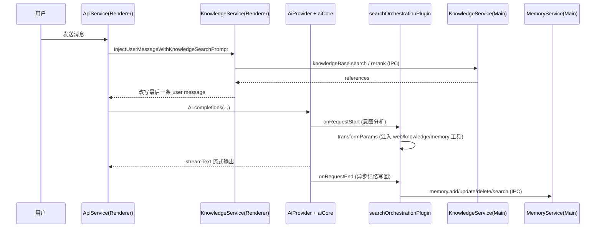

# 07-知识库与长期记忆系统

本章从“**一次 LLM 调用**”视角，完整解释知识库（RAG）与长期记忆（Memory）在 Cherry Studio 中如何被组装、触发、执行、降级和落库。

## 先看结论

- 知识库用于“外部资料检索”（文件、目录、网页、站点地图、笔记）。
- 长期记忆用于“用户长期事实沉淀”（偏好、身份、计划等）。
- 两者都由主进程持久化，渲染层负责编排。
- 二者在同一请求中可以并行协同，但触发条件不同。

## 一次 LLM 调用的主链路（总览）

入口：`src/renderer/src/services/ApiService.ts`

关键事实：

1. 聊天主调用路径始终走 `streamText`（非 `generateText`）。
2. 知识库有两条入口：
   - 请求前 Prompt 预注入
   - 运行时工具调用
3. 记忆在当前实现中主要通过 `searchOrchestrationPlugin` 承载：
   - 运行时检索（工具）
   - 请求结束后异步写回

## 触发条件矩阵（非常关键）

| 能力 | 触发前提 | 说明 |
| --- | --- | --- |
| 知识预注入 | assistant 绑定知识库 | 与工具调用开关无关 |
| 知识工具调用 | 1) 插件已挂载 2) `knowledgeRecognition = on` 3) 意图分析判断需要检索 | 三个条件缺一不可 |
| 记忆工具检索 | 1) 插件已挂载 2) `globalMemoryEnabled = true` 3) `assistant.enableMemory = true` | 当前实现不做意图门控 |
| 记忆写回 | 插件已挂载 + 全局记忆开启 + 助手记忆开启 | 在 `onRequestEnd` 异步执行 |
| Web 搜索工具 | 插件已挂载 + 配置了 `webSearchProviderId` + 意图分析命中 | 与知识库可同时启用 |

补充：插件挂载条件在 `PluginBuilder` 中是：

- `isSupportedToolUse(assistant)` 或 `isPromptToolUse(assistant)` 为真。

这意味着：如果工具调用链没启用，`searchOrchestrationPlugin` 不会执行；知识预注入仍可工作，但工具路径和记忆写回路径不会触发。

## 请求阶段的“上下文拼装顺序”

以 `transformMessagesAndFetch` -> `fetchChatCompletion` 为主线：

1. `ConversationService.prepareMessagesForModel` 产出 `modelMessages`。
2. 调 `injectUserMessageWithKnowledgeSearchPrompt`（可选）：
   - 拉取知识引用
   - 写 citation block
   - 将最后一条 user message 改写为 `REFERENCE_PROMPT`
3. `buildStreamTextParams` 构建调用参数：
   - `temperature/topP/maxOutputTokens`
   - `providerOptions`
   - `tools`（MCP）
   - `system`
   - `abortSignal`（空闲超时 + 外部中断合并）
4. 组装 `AiSdkMiddlewareConfig`：
   - `isPromptToolUse` / `isSupportedToolUse`
   - `enableWebSearch` / `enableUrlContext` / `enableGenerateImage`
   - `knowledgeRecognition`
5. `AiProvider.completions` -> `createExecutor(...).streamText(...)`。
6. 插件生命周期执行：
   - `onRequestStart`
   - `transformParams`
   - 流式生成
   - `onRequestEnd`

## 知识库链路（RAG）详解

主进程：`src/main/services/KnowledgeService.ts`  
渲染层：`src/renderer/src/services/KnowledgeService.ts`

### 1. 离线构建链路（导入与索引）

知识库底层基于 `@cherrystudio/embedjs` + `LibSqlDb`。

核心步骤：

1. `getRagApplication(base)`：按知识库 `id` 复用 `RAGApplication` 实例。
2. 按 item 类型构建任务：
   - `fileTask`
   - `directoryTask`
   - `urlTask`
   - `sitemapTask`
   - `noteTask`
3. 入队后由内部调度器按负载并发处理：
   - `MAXIMUM_WORKLOAD = 80MB`
   - `MAXIMUM_PROCESSING_ITEM_COUNT = 30`
4. 对 PDF 且配置了预处理 provider 时，先做 preprocess，再 embedding。
5. 导入完成后返回 `uniqueId/uniqueIds` 作为后续删除与重建锚点。

启动可靠性：

- 启动时会读取 `knowledge_pending_delete.json` 清理上次未删干净目录。
- 删除流程会先清理内存中的 RAG/DB 引用，再删磁盘目录；失败则加入 pending list 下次再删。

### 2. 在线检索链路（query -> references）

渲染层 `searchKnowledgeBase`：

1. 先按 embedding 模型的 `max_context` 截断超长 query。
2. IPC 调主进程 `knowledgeBase.search`。
3. 本地阈值过滤（`threshold`）。
4. 若配置 rerank 模型，则调用 `knowledgeBase.rerank`。
5. 按 `documentCount` 截断。
6. 转为引用对象（包含 `content/sourceUrl/metadata`）。

`processKnowledgeSearch` 进一步做：

- 多问题并行搜索
- 多知识库并行搜索
- `uniqueId/pageContent` 去重
- 统一分数排序
- 重新分配引用 ID（用于 `[1] [2]` 引用）

### 3. 进入 LLM 的两条路径

#### 路径 A：请求前预注入

`injectUserMessageWithKnowledgeSearchPrompt` 直接改写最后一条 user message。

优点：

- 首轮就有知识上下文。
- 不依赖模型是否会主动发起工具调用。

代价：

- 会增加 prompt token。
- 如果引用过多，可能挤压其它上下文预算。

#### 路径 B：工具调用按需检索

`searchOrchestrationPlugin.transformParams` 动态注入 `builtin_knowledge_search`。

触发条件：

- 助手绑定知识库
- `knowledgeRecognition === 'on'`
- 意图分析结果不是 `not_needed`

优点：

- 按需调用，token 更弹性。
- 模型可以“先回答，再补检索”或“先检索再回答”。

代价：

- 依赖模型工具调用行为。
- 需要工具链能力开启。

### 4. 知识检索结果如何回到 UI

有两条引用展示路径：

1. 预注入路径：`injectUserMessageWithKnowledgeSearchPrompt` 中创建 citation block。
2. 工具路径：`toolCallbacks.onToolCallComplete` 对 `builtin_knowledge_search` 创建 citation block。

## 长期记忆链路详解

主进程：`src/main/services/memory/MemoryService.ts`  
渲染层：`src/renderer/src/services/MemoryService.ts`、`src/renderer/src/services/MemoryProcessor.ts`

### 1. 存储模型与表结构

Memory DB：`{DATA_PATH}/Memory/memories.db`

核心表：

- `memories`
- `memory_history`

关键字段：

- `hash`：文本哈希去重
- `embedding F32_BLOB(1536)`：向量列
- `user_id` / `agent_id`：作用域隔离
- `is_deleted`：软删除标记

索引策略：

- 普通索引：`user_id/agent_id/hash/created_at`
- 向量索引：`libsql_vector_idx(embedding)`
- 向量索引失败时仅告警并降级，不阻塞服务启动

### 2. 记忆读路径（检索）

`builtin_memory_search` -> `MemoryProcessor.searchRelevantMemories` -> `window.api.memory.search`。

主进程 `search` 策略：

1. 若配置 embedding 模型：先做向量检索（`hybridSearch`，当前主要是向量分支）。
2. 若向量结果为空或向量流程失败：回退文本检索（`LIKE`）。
3. 默认带作用域过滤：
   - `user_id = ?`
   - `agent_id = ? OR agent_id IS NULL`

### 3. 记忆写路径（请求结束后）

触发位置：`searchOrchestrationPlugin.onRequestEnd`。

执行流程：

1. 过滤对话消息（仅 user/assistant，去掉空文本）。
2. `MemoryProcessor.extractFacts`：调用 LLM 提取事实（JSON schema 校验）。
3. `MemoryProcessor.updateMemories`：
   - 与已有记忆比对
   - 生成 `ADD/UPDATE/DELETE/NONE`
4. 调 `memoryService.add/update/delete` 写入主进程。

注意：

- 整体以异步后台执行，不阻塞本轮回复返回。
- 异常会记录日志，但不会打断主聊天链路。

### 4. 去重、恢复与兼容策略

`MemoryService.add` 关键策略：

1. 文本先做 SHA-256 哈希去重。
2. 若命中“同 hash 但已删除”记录：恢复旧记录而不是新建。
3. 若配置 embedding：再做相似度去重。
   - 候选检索阈值（内部查询）较低，先找近邻。
   - 最终去重阈值：`SIMILARITY_THRESHOLD = 0.85`。
4. embedding 维度统一归一到 `1536`：
   - 维度不足补零
   - 维度超出截断

收益：

- 降低模型切换带来的历史向量不兼容问题。
- 避免语义重复记忆不断膨胀。

## 搜索编排插件在一轮请求中的角色

文件：`src/renderer/src/aiCore/plugins/searchOrchestrationPlugin.ts`

### Step 1: `onRequestStart`（意图分析）

- 若 web/knowledge/memory 都未配置，直接返回。
- 仅当 web 或 knowledge 需要时发起意图分析。
- 意图分析调用 `generateText`，解析 XML 结果。
- 失败则 fallback：使用用户原问题作为检索词。

### Step 2: `transformParams`（动态注入工具）

- 初始化 `params.tools`。
- 根据意图结果注入：
  - `builtin_web_search`
  - `builtin_knowledge_search`
- 根据开关注入：
  - `builtin_memory_search`

### Step 3: `onRequestEnd`（记忆写回）

- 调用 `storeConversationMemory` 异步处理。
- 清理 request 级缓存（`intentAnalysisResults/userMessages`）。

## 失败与降级分层

| 层级 | 典型失败 | 降级策略 | 是否影响主回复 |
| --- | --- | --- | --- |
| 意图分析层 | `generateText` 失败、XML 解析失败 | fallback 到用户原 query | 否 |
| 知识检索层 | search/rerank 报错、结果为空 | 返回空引用或仅保留基础检索 | 一般否 |
| 记忆检索层 | 向量检索失败 | 回退文本检索 | 否 |
| 记忆写回层 | 提取/解析/落库失败 | 记录日志并跳过本次写回 | 否 |
| 存储索引层 | 向量索引创建失败 | 非索引检索 | 否 |

## 两个典型请求场景

### 场景 A：基于私有文档回答

1. 用户提问。
2. 请求前进行知识预注入（若绑定知识库）。
3. 模型开始回答；若插件路径判定需要，可能再次触发知识工具补检索。
4. UI 同步展示 citation block。

### 场景 B：对话中形成长期偏好

1. 用户连续多轮表达偏好。
2. 当前轮结束后，`onRequestEnd` 触发记忆抽取。
3. 主进程执行 hash + 向量去重。
4. 后续轮次模型可通过 `builtin_memory_search` 检索到这些偏好。

## 扩展与改造建议（按落点）

- 扩展知识导入源：`src/main/services/KnowledgeService.ts` 的 task 分派。
- 替换 rerank 策略：`src/main/knowledge/reranker/`。
- 调整意图分析提示词：`src/renderer/src/config/prompts` 与插件解析逻辑。
- 优化记忆抽取模板：`src/renderer/src/utils/memory-prompts.ts`。
- 调整去重阈值/检索阈值：`MemoryService` 内常量与查询参数。

## 排障清单（按执行顺序）

### 1. “知识库没生效”

1. 检查 assistant 是否绑定知识库。
2. 检查是走预注入路径还是工具路径。
3. 工具路径下检查：`knowledgeRecognition` 是否 `on`。
4. 检查阈值 `threshold` 是否过高。
5. 检查 rerank 配置与 provider key 是否可用。

### 2. “记忆没有召回”

1. 检查 `globalMemoryEnabled` 与 `assistant.enableMemory`。
2. 检查当前请求是否启用了工具调用链（插件是否挂载）。
3. 检查 memory embedding 配置是否完整。
4. 检查 `userId/agentId` 是否与写入时一致。
5. 查看日志是否发生“向量失败 -> 文本回退”。

### 3. “记忆没有写回”

1. 检查插件是否挂载并执行到了 `onRequestEnd`。
2. 检查消息是否包含有效 user+assistant 文本。
3. 检查事实抽取 JSON 是否通过 schema。
4. 检查 `memory.add/update/delete` IPC 是否报错。

## 关键源码索引

| 主题 | 入口 |
| --- | --- |
| 请求编排入口 | `src/renderer/src/services/ApiService.ts` |
| 参数构建 | `src/renderer/src/aiCore/prepareParams/parameterBuilder.ts` |
| AI 执行入口 | `src/renderer/src/aiCore/AiProvider.ts` |
| 插件组装 | `src/renderer/src/aiCore/plugins/PluginBuilder.ts` |
| 搜索编排插件 | `src/renderer/src/aiCore/plugins/searchOrchestrationPlugin.ts` |
| 知识检索编排（渲染） | `src/renderer/src/services/KnowledgeService.ts` |
| 知识工具 | `src/renderer/src/aiCore/tools/KnowledgeSearchTool.ts` |
| 记忆工具 | `src/renderer/src/aiCore/tools/MemorySearchTool.ts` |
| 记忆处理编排（渲染） | `src/renderer/src/services/MemoryProcessor.ts` |
| 知识库服务（主进程） | `src/main/services/KnowledgeService.ts` |
| 记忆服务（主进程） | `src/main/services/memory/MemoryService.ts` |
| 记忆 SQL | `src/main/services/memory/queries.ts` |
| IPC 绑定 | `src/main/ipc.ts` |
