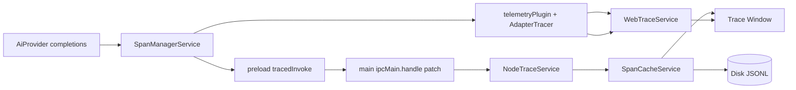

# 09-可观测性与调试

AI 链路调试依赖四部分协同：

1. `mcp-trace` 基础库（OpenTelemetry 封装）
2. 渲染侧 Trace 注入与 Span 管理
3. 主进程 Trace 接收、缓存与持久化
4. Trace 窗口展示

## 组件关系



## 一、mcp-trace 基础库

位置：`packages/mcp-trace/`

### 1.1 trace-core（共享核心）

位置：`packages/mcp-trace/trace-core/`

**核心类型**（`types/config.ts`）：

- `SpanEntity` — 应用内统一使用的 Span 表示，字段包括：`id`、`name`、`parentId`、`traceId`、`status`、`kind`、`attributes`、`isEnd`、`events`、`startTime`、`endTime`、`links`、`topicId`、`usage`（`TokenUsage`）、`modelName`
- `TokenUsage` — `{ prompt_tokens, completion_tokens, total_tokens, prompt_tokens_details? }`
- `TraceCache` 接口（`core/traceCache.ts`）— 定义 `createSpan()` / `endSpan()` / `clear()` 三个方法，用于 Span 生命周期回调

**Span 转换**（`core/spanConvert.ts`）：

- `convertSpanToSpanEntity(span: ReadableSpan): SpanEntity` — 将 OpenTelemetry `ReadableSpan` 转换为 `SpanEntity`，处理时间戳（转为毫秒）、提取 `modelName` 等属性

**自定义 Exporter**：

- `FunctionSpanExporter`（`exporters/FuncSpanExporter.ts`）— 将自定义异步函数 `(spans: ReadableSpan[]) => Promise<void>` 包装为 OpenTelemetry `SpanExporter`

**自定义 Processor**（均继承 `BatchSpanProcessor`）：

| Processor | 文件 | 作用 |
|---|---|---|
| `CacheBatchSpanProcessor` | `processors/CacheSpanProcessor.ts` | Span 开始/结束时委托给 `TraceCache.createSpan()` / `TraceCache.endSpan()`，主进程用于填充 `SpanCacheService` |
| `FunctionSpanProcessor` | `processors/FuncSpanProcessor.ts` | 调用自定义的开始/结束函数，渲染进程 `WebTraceService` 使用 |
| `EmitterSpanProcessor` | `processors/EmitterSpanProcessor.ts` | 通过 `EventEmitter` 发出 Span 开始/结束事件 |

**装饰器**（`core/traceMethod.ts`）：

- `@TraceMethod(options)` / `@TraceProperty(options)` — 自动为方法/属性包装 Span 的 TypeScript 装饰器
- `withSpanFunc(name, tag, fn, args)` — 将任意函数包裹在 Span 中执行

### 1.2 trace-node（主进程 Tracer）

位置：`packages/mcp-trace/trace-node/nodeTracer.ts`

- `NodeTracer.init(config?, spanProcessor?)` — 创建 `NodeTracerProvider`，配置 `AsyncLocalStorageContextManager` 和 `W3CTraceContextPropagator`。接受自定义 `SpanProcessor`
- `NodeTracer.getTracer()` — 返回默认 tracer

### 1.3 trace-web（渲染进程 Tracer）

位置：`packages/mcp-trace/trace-web/`

**`TopicContextManager`**（`TopicContextManager.ts`）：

- 实现 OpenTelemetry 的 `ContextManager` 接口
- 维护按 `topicId` 隔离的上下文栈（`topicContextStack: Map<string, Context[]>`）和当前上下文（`_topicContexts: Map<string, Context>`）
- 关键方法：`startContextForTopic()`、`getContextForTopic()`、`endContextForTopic()`、`cleanContextForTopic()`
- `active()` 返回 `ROOT_CONTEXT`，上下文传播必须显式进行

**`WebTracer`**（`webTracer.ts`）：

- `WebTracer.init(config?, spanProcessor?)` — 创建 `WebTracerProvider`，使用自定义 `TopicContextManager`
- 导出：`startContext`、`getContext`、`endContext`、`cleanContext`

**`TraceContextPromise`**（`traceContextPromise.ts`）：

- 继承 `Promise<T>`，跨异步边界捕获并传播 OpenTelemetry `Context`
- 重写 `resolve`、`reject`、`all`、`race`、`allSettled`、`any` 以维持上下文
- `instrumentPromises()` 将 `globalThis.Promise` 替换为 `TraceContextPromise`

## 二、渲染侧追踪

### 2.1 WebTraceService（初始化入口）

位置：`src/renderer/src/services/WebTraceService.ts`
初始化时机：`src/renderer/src/init.ts` 中调用 `webTraceService.init()`

作用：

- 创建 `FunctionSpanExporter` 和 `FunctionSpanProcessor`
- Processor 在 Span 开始/结束时调用 `window.api.trace.saveEntity()` 将 Span 发送到主进程
- 初始化 `WebTracer` 实例

### 2.2 SpanManagerService（Span 树管理）

位置：`src/renderer/src/services/SpanManagerService.ts`

**核心能力**：

- 为 `topic/model` 建立 Span 树
- 在重发、追加消息时重建追踪上下文
- 聚合 token usage、输出、错误状态
- 与 Trace 窗口联动

**关键方法**：

| 方法 | 说明 |
|---|---|
| `startTrace(params, models?)` | 创建根 Span 及按模型的根 Span，通过 IPC 绑定 topic 到 traceId |
| `restartTrace(message, text?)` | 重发消息时重新追踪 |
| `appendMessageTrace(message, model)` | 追加消息时建立追踪 |
| `endTrace(params)` | 结束 topic 下所有活跃 Span，保存数据到主进程，清理上下文 |
| `addSpan(params)` | 在当前 Span 或指定父 Span 下创建子 Span |
| `endSpan(params)` | 结束指定 Span 或当前活跃 Span |
| `getCurrentSpan(topicId, modelName?, isRoot?)` | 获取 topic/model 的活跃 Span |
| `addTokenUsage(topicId, prompt, completion)` | 上报 token 使用量到主进程 |
| `finishModelTrace(topicId)` | 结束 topic 下所有 Span 并清空 SpanMap |

**`ModelSpanEntity`**（`src/renderer/src/trace/types/ModelSpanEntity.ts`）：

- 按 topic + model 维度的 Span 容器，包含 Span 栈（`spans: Span[]`）和根 Span
- 方法：`addSpan()`、`removeSpan()`、`getCurrentSpan()`、`getRoot()`、`getRootSpan()`、`getSpanById()`、`finishSpan()`、`addModelError()`

**`withSpanResult(fn, params, ...args)`**（line 314-360）：

- 将函数执行包裹在 Span 中，支持 Promise、Stream（`Stream` / `MessageStream`）和普通结果
- 使用 dataHandler 处理流式结果

### 2.3 telemetryPlugin（AI SDK 遥测插件）

位置：`src/renderer/src/aiCore/plugins/telemetryPlugin.ts`

**`AdapterTracer` 类**：

- 包装原始 OpenTelemetry tracer
- 在 `startSpan()` 时注入父 Span 上下文为 `trace.parentSpanId` / `trace.parentTraceId` 属性
- 重写 Span 的 `end()` 方法：(1) 调用原始 `end()` → (2) 通过 `AiSdkSpanAdapter.convertToSpanEntity()` 转换 → (3) 通过 `window.api.trace.saveEntity()` 保存

**`createTelemetryPlugin(config)`**：

- 返回 `AiPlugin`，设置 `enforce: 'pre'`（在其他插件之前执行）
- 在 `transformParams` 中：
  1. 从 `webTraceService.getTracer()` 获取 tracer
  2. 从 `SpanManagerService.currentSpan(topicId, modelName)` 查找当前父 Span
  3. 创建 `AdapterTracer` 并携带父 Span 上下文
  4. 注入 `experimental_telemetry: { isEnabled: true, tracer: adapterTracer, ... }` 到 AI SDK 参数中
  5. 用父 Span 更新当前 OTel 上下文

**集成点**（`src/renderer/src/aiCore/plugins/PluginBuilder.ts` line 43-51）：

- 当 `config.topicId` 存在且 Developer Mode 启用时，`createTelemetryPlugin` 作为第一个插件（index 0）注入

### 2.4 AiSdkSpanAdapter（AI SDK Span 适配）

位置：`src/renderer/src/aiCore/trace/AiSdkSpanAdapter.ts`

**`convertToSpanEntity(spanData)`**：

- 兼容多种属性获取路径（`_attributes`、`getAttributes()`、直接 `.attributes`）
- 从 `ai.usage.promptTokens` / `ai.usage.completionTokens` 或 `gen_ai.usage.input_tokens` / `gen_ai.usage.output_tokens` 提取 token usage
- 根据 `ai.operationId`（如 `ai.generateText`、`ai.streamText.doStream`、`ai.toolCall`）提取输入/输出
- 映射 Span 标签：`LLM-GENERATE`、`LLM-STREAM`、`PROVIDER-GENERATE`、`PROVIDER-STREAM`、`TOOL-CALL`、`IMAGE`、`EMBEDDING`
- 提取类型专属数据（provider ID、model ID、性能指标如 `msToFirstChunk`）

### 2.5 AiProvider Trace 集成

位置：`src/renderer/src/aiCore/AiProvider.ts`

在 `completions()` 中，若设置了 `topicId` 且 Developer Mode 启用：

1. 调用 `_completionsForTrace()` 创建父 Span（通过 `SpanManagerService.addSpan()`）
2. 执行 `modernCompletions()`（触发 `telemetryPlugin` 创建 AI SDK 内部子 Span）
3. 以输出或错误结束父 Span

### 2.6 DataHandler（流式数据处理）

位置：`src/renderer/src/trace/dataHandler/`

| Handler | 文件 | 适配对象 |
|---|---|---|
| `StreamHandler` | `StreamHandler.ts` | OpenAI 兼容的 `Stream<ChatCompletionChunk | ResponseStreamEvent>`，遍历 chunk 提取文本/reasoning/tool_calls，累加 token usage |
| `MessageStreamHandler` | `MessageStreamHandler.ts` | Anthropic `MessageStream`，监听 `message` / `end` 事件，提取文本/thinking/tool_use 内容 |
| `CommonResultHandler` | `CommonResultHandler.ts` | 非流式 `CompletionsResult`，提取 usage 元数据并结束 Span |

## 三、IPC Trace 透传

### 3.1 tracedInvoke（Preload 层）

位置：`src/preload/index.ts`（line 91-97）

```typescript
export function tracedInvoke(channel: string, spanContext: SpanContext | undefined, ...args: any[]) {
  if (spanContext) {
    const data = { type: 'trace', context: spanContext }
    return ipcRenderer.invoke(channel, ...args, data)
  }
  return ipcRenderer.invoke(channel, ...args)
}
```

在 `ipcRenderer.invoke` 调用末尾附带 Span context。

### 3.2 ipcMain.handle 拦截（主进程）

位置：`src/main/services/NodeTraceService.ts`（line 33-46）

重写 `ipcMain.handle`，拦截所有 IPC 调用。若最后一个参数包含 `{ type: 'trace', context: SpanContext }`，则提取 Span context 并将 handler 执行包裹在该 OTel 上下文中。

**调用场景**：`knowledgeBase.create`、`knowledgeBase.search`、`knowledgeBase.rerank`、`mcp.listTools`、`mcp.callTool`、`file.clear`。

### 3.3 Trace IPC API

Preload 暴露的 Trace API（`src/preload/index.ts` `api.trace`，line 684-703）：

| API | 说明 |
|---|---|
| `saveData(topicId)` | 保存 topic 下所有 Span 到磁盘 |
| `getData(topicId, traceId, modelName?)` | 获取 Span 数据 |
| `saveEntity(entity)` | 保存单个 Span 实体 |
| `getEntity(spanId)` | 获取单个 Span 实体 |
| `bindTopic(topicId, traceId)` | 绑定 Trace 到 Topic |
| `tokenUsage(spanId, usage)` | 上报 Token 使用量 |
| `cleanHistory(topicId, traceId, modelName?)` | 清理历史 Trace |
| `cleanTopic(topicId, traceId?)` | 清理 Topic Trace |
| `openWindow(topicId, traceId, autoOpen?, modelName?)` | 打开 Trace 查看窗口 |
| `setTraceWindowTitle(title)` | 设置 Trace 窗口标题 |
| `addEndMessage(spanId, modelName, context)` | 添加 Span 结束消息 |
| `cleanLocalData()` | 清理本地 Trace 数据 |
| `addStreamMessage(spanId, modelName, context, message)` | 添加流式消息到 Span |

IPC Channel 常量定义在 `packages/shared/IpcChannel.ts`（line 359-371），共 13 个 channel。

主进程 IPC handler 在 `src/main/ipc.ts`（line 940-966），委托给 `SpanCacheService` 导出函数及 `NodeTraceService.openTraceWindow` / `setTraceWindowTitle`。

## 四、主进程 Trace 服务

### 4.1 NodeTraceService

位置：`src/main/services/NodeTraceService.ts`

初始化流程（`src/main/index.ts` line 168）：

```typescript
nodeTraceService.init()  // 设置 NodeTracerProvider + CacheBatchSpanProcessor + SpanCacheService
```

职责：

- 创建 `FunctionSpanExporter`（当前记录 Span 数量日志）和 `CacheBatchSpanProcessor`，后者将 Span 路由到 `spanCacheService`
- 初始化 `MCPNodeTracer`
- Monkey-patch `ipcMain.handle` 实现 trace context 传播
- 管理 Trace 窗口：创建、更新、发送 `set-trace` / `set-language` 事件

### 4.2 SpanCacheService

位置：`src/main/services/SpanCacheService.ts`

实现 `TraceCache` 接口，负责 Span 的内存缓存与磁盘持久化。

**关键方法**：

| 方法 | 说明 |
|---|---|
| `createSpan(span: ReadableSpan)` | 转换为 `SpanEntity`，绑定 `topicId`，存入缓存 |
| `endSpan(span: ReadableSpan)` | 更新 Span 的 `endTime`、`status`、`attributes`、`events`、`links` |
| `setTopicId(traceId, topicId)` | 绑定 trace 到 topic |
| `saveEntity(entity: SpanEntity)` | 手动保存/更新 Span 实体 |
| `updateTokenUsage(spanId, usage)` | 更新 Span 的 token usage 并沿父链路累加总量 |
| `addStreamMessage(spanId, modelName, context, message)` | 累积 Span 上的流式输出消息 |
| `setEndMessage(spanId, modelName, message)` | 设置最终输出消息 |
| `getSpans(topicId, traceId, modelName?)` | 从缓存或磁盘获取 Span |
| `saveSpans(topicId)` | 将缓存的 Span 刷盘（JSONL 格式） |
| `cleanTopic()` / `cleanHistoryTrace()` / `cleanLocalData()` | 清理方法 |

**存储结构**：

- 磁盘路径：`~/CherryAI/trace/`
- 每个 Trace 为 JSONL 文件：`{topicId}/{traceId}`

**导出便捷函数**（line 397-407）：`cleanTopic`、`saveEntity`、`getEntity`、`tokenUsage`、`saveSpans`、`getSpans`、`addEndMessage`、`bindTopic`、`addStreamMessage`、`cleanHistoryTrace`、`cleanLocalData` — 全部绑定到单例 `spanCacheService`。

## 五、Trace 窗口

### 5.1 入口

位置：`src/renderer/src/trace/traceWindow.tsx`

- 监听主进程发送的 `set-trace` 事件（携带 `{ traceId, topicId, modelName }`）
- 监听 `set-language` 事件用于国际化
- 渲染 `TracePage` 组件

### 5.2 TracePage

位置：`src/renderer/src/trace/pages/index.tsx`

- 每 300ms 轮询获取 Span 数据（`window.api.trace.getData(topicId, traceId, modelName)`）
- 通过 `getRootSpan()` 从扁平 Span 列表构建树（按 `parentId` 分组）
- 计算相对起始位置和持续时长百分比
- 展示 `TraceTree`（层级 Span 列表）或 `SpanDetail`（单个 Span 详情检查）
- 所有 Span 都有 `endTime` 时停止轮询

## 六、完整数据流

```
AI 请求发起 (AiProvider.completions)
  │
  ├─ SpanManagerService.startTrace() → 创建根 Span
  │
  ├─ telemetryPlugin.transformParams() → 注入 experimental_telemetry + AdapterTracer
  │     │
  │     ├─ AI SDK 内部产生 Span (generateText, streamText, toolCall, ...)
  │     │     └─ AdapterTracer.end() → AiSdkSpanAdapter.convertToSpanEntity()
  │     │           → window.api.trace.saveEntity() → IPC → SpanCacheService
  │     │
  │     └─ 父 Span 上下文注入为 trace.parentSpanId / trace.parentTraceId
  │
  ├─ withSpanResult() → 包裹执行结果在 Span 中
  │     ├─ StreamHandler → 流式 chunk 逐条上报
  │     ├─ MessageStreamHandler → Anthropic 事件流上报
  │     └─ CommonResultHandler → 非流式结果一次性上报
  │
  └─ SpanManagerService.endTrace() → 结束所有 Span → saveData() 刷盘

IPC 跨进程传播：
  tracedInvoke(channel, spanContext, ...args)
    → 附加 { type: 'trace', context: spanContext }
    → ipcMain.handle 拦截 → 包裹 handler 在 OTel 上下文中执行
    → 主进程产生的 Span 与渲染侧调用串为同一条链路

Trace 窗口展示：
  SpanCacheService (内存缓存 + JSONL 磁盘文件)
    ← IPC handler ← window.api.trace.getData()
    → TracePage 轮询渲染 → SpanTree / SpanDetail
```

## 七、诊断建议

排查 AI 请求异常时建议按顺序检查：

1. **根 Span 创建** — 是否生成了 topic/model 根 Span（检查 `SpanManagerService.startTrace()` 是否正常调用）
2. **插件阶段错误** — 是否出现 `onRequestStart` / `transformParams` 阶段错误（检查 `telemetryPlugin` 是否正确注入）
3. **MCP 工具调用** — 是否有 MCP 工具调用 Span 与结果事件（检查 `tracedInvoke` 是否正确附带 context）
4. **IPC context 丢失** — 主进程 IPC context 是否丢失（检查 `ipcMain.handle` monkey-patch 是否生效）
5. **Span 持久化** — Span 数据是否正确写入磁盘（检查 `~/CherryAI/trace/{topicId}/{traceId}` JSONL 文件）
6. **AI SDK 适配** — AI SDK 内部 Span 是否正确转换（检查 `AiSdkSpanAdapter.convertToSpanEntity()` 属性提取）

### 常见排查命令

```bash
# 查看特定 topic 的 trace 文件
ls ~/CherryAI/trace/<topicId>/

# 查看 trace JSONL 内容
cat ~/CherryAI/trace/<topicId>/<traceId> | jq .

# 检查 Developer Mode 是否开启
# 设置 → 开发者模式 → 启用 Trace
```

