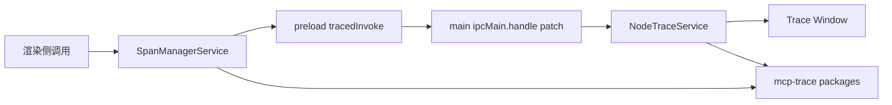

# 09-可观测性与调试

AI 链路调试依赖三部分协同：

1. 渲染侧 Span 管理
2. 主进程 Trace 接收与窗口展示
3. mcp-trace 基础库

## 组件关系

## 渲染侧追踪

入口：`src/renderer/src/services/SpanManagerService.ts`

能力：

- 为 topic/model 建立 span 树
- 在重发、追加消息时重建追踪上下文
- 聚合 token usage、输出、错误状态
- 与 trace 窗口联动

开发模式下，`AiProvider` 会进入 trace 分支（`_completionsForTrace`），通过 `addSpan()` 创建 parent span，确保 AI SDK spans 在正确上下文中记录。`telemetryPlugin` 通过 `AiSdkSpanAdapter` 将 AI SDK 内部 span 转换为 Cherry Studio 格式。

## IPC Trace 透传

入口：

- `src/preload/index.ts` 中 `tracedInvoke`
- `src/main/services/NodeTraceService.ts` 对 `ipcMain.handle` 的 trace context 包装

机制：

1. preload 在 `ipcRenderer.invoke` 末尾附带 span context。
2. 主进程接收后恢复 context，再执行 handler。

这样主进程服务产生的 span 能与渲染侧调用串成同一条链路。

## 主进程 Trace 服务

`NodeTraceService` 初始化 `mcp-trace` 的 Node tracer，并维护 trace 窗口：

- 初始化 exporter/processor
- 打开与更新 traceWindow
- 保存 topic 与 traceId 绑定关系

## 诊断建议

排查 AI 请求异常时建议按顺序检查：

1. 是否生成了 topic/model 根 span。
2. 是否出现插件阶段错误（`onRequestStart/transformParams`）。
3. 是否有 MCP 工具调用 span 与结果事件。
4. 是否存在主进程 IPC context 丢失。

