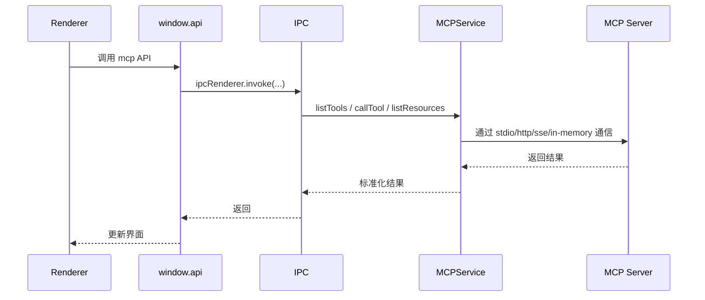

# 08-MCP 与扩展能力

## MCP 在项目中的位置

Cherry Studio 没有把工具调用完全绑定到单个模型 Provider，而是把 MCP 作为独立扩展层建设。主实现入口是 `src/main/services/MCPService.ts`。

这意味着：

- MCP 是主进程长期服务，不是前端工具函数。
- 工具、资源、提示词、OAuth、日志和生命周期都由主进程统一托管。
- 渲染层只通过 `window.api.mcp` 消费标准化能力。

## `MCPService` 当前负责什么

从当前代码可见，它主要负责：

- 初始化和维护 MCP client
- 管理 server 的启动、重连、停止和移除
- 列出 `tools`、`prompts`、`resources`
- 调用和取消工具
- 缓存工具清单与运行时状态
- 处理 OAuth、日志和动态通知

当前支持的连接方式包括：

- `stdio`
- `sse`
- `streamableHttp`
- `in-memory`

## 为什么 MCP 放在主进程

原因很直接：

- 需要管理进程和连接生命周期
- 需要访问本地命令、环境变量和网络连接
- 需要缓存和统一脱敏日志
- 需要跨窗口复用工具状态

这些都更适合主进程，而不适合页面层自己维护。

## MCP 调用流程

## Hub 与聚合思路

项目中存在 `src/main/mcpServers/hub/`，说明 Cherry Studio 并不要求上层始终关心“工具属于哪个 server”。

当前设计方向是：

- 多个 MCP server 的工具可以聚合成统一工具空间
- 自动模式下模型先面对 Hub，再由主进程桥接到具体 server
- 工具变更、资源变更和日志可以动态推送到前端

这是典型的工具总线模式。

## Trace 与扩展能力

MCP 只是扩展层的一部分，追踪能力通过 `packages/mcp-trace`、`NodeTraceService` 和 Trace 窗口把模型调用、工具调用和 IPC 串成一条链。

这让扩展能力不是“黑盒工具调用”，而是可以被观察、调试和可视化的运行时系统。

## 其他扩展能力

MCP 之外，项目里还有一批遵循类似模式的扩展服务：

- `packages/ai-sdk-provider`
- Agent 技能与渠道适配
- `OpenClawService`
- `CodeToolsService`
- `PythonService`
- OCR、搜索、外部应用与 Webview 相关服务

共同点是：

- 高权限与长生命周期放主进程
- 产品控制入口放渲染进程
- 通过 IPC 或统一抽象协作

## 架构意义

这一层把 Cherry Studio 从“模型聊天客户端”扩展成“可托管外部能力的桌面 AI 工作台”。这也是它与普通聊天壳项目的关键区别之一。
