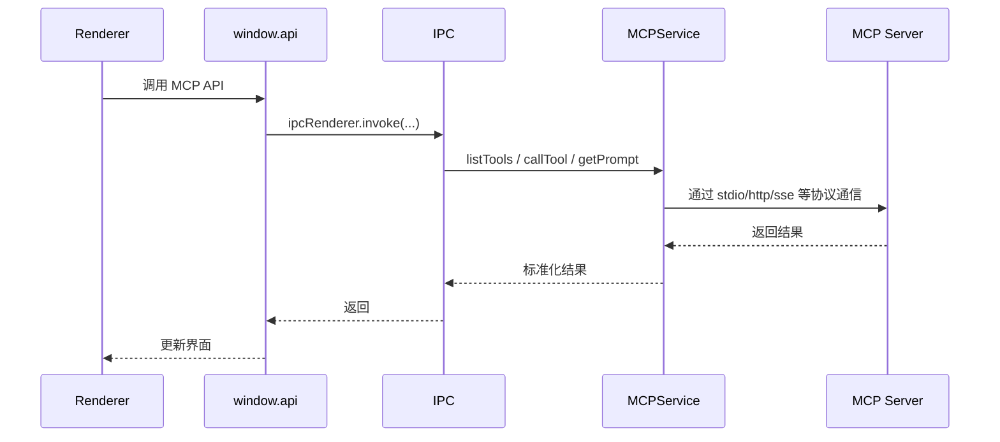

# 08-MCP 与扩展能力

## MCP 在项目中的位置

Cherry Studio 并没有把工具调用完全绑定到模型 provider，而是把 MCP 作为独立扩展层来建设。

主实现入口是 `src/main/services/MCPService.ts`。

这说明 MCP 是主进程服务，而不是前端页面工具函数。

## `MCPService` 做什么

从源码可以看出它负责：

- 初始化 MCP client
- 维护多个 server client 实例
- 缓存工具列表等结果
- 调用 tool
- 列出 prompt / resource
- 处理 server restart / stop / remove
- 管理活动中的 tool call
- 收集 server log

支持的连接方式包括：

- `stdio`
- `sse`
- `streamableHttp`
- `in-memory`

这说明 Cherry Studio 把 MCP 看作一类“可托管外部能力”，而不是单一协议插件。

## MCP 为什么要放主进程

原因很直接：

- 需要管理进程与连接生命周期
- 需要访问本地命令、环境变量和网络连接
- 需要统一缓存和日志
- 需要在多个窗口之间复用

这些都更适合主进程。

## MCP 调用流程

## Hub 与聚合思路

源码里存在 `src/main/mcpServers/hub/`，同时 `MCPService` 提供 `listAllActiveServerTools()` 和 `callToolById()` 这类聚合能力。这说明项目有一个明显设计方向：

- 把多个 MCP server 的能力汇聚成统一工具空间
- 上层不一定关心工具来自哪个 server

这是典型的“工具总线”思路。

## 追踪系统 `mcp-trace`

`packages/mcp-trace` 分成：

- `trace-core`
- `trace-node`
- `trace-web`

主进程通过 `NodeTraceService` 初始化 node tracer，渲染侧通过 `webTraceService` 接入。IPC 调用还会携带 span context。

这带来两个价值：

- 可以把模型调用、MCP 调用、窗口行为串成一条调用链
- 可以给独立的 Trace 窗口提供数据来源

## Trace Window

`openTraceWindow()` 会打开独立窗口显示 trace 数据，并在加载后注入：

- `traceId`
- `topicId`
- `modelName`
- 当前语言

所以追踪能力不是隐藏式日志，而是面向产品的可视化能力。

## 其他扩展能力

项目的扩展点不只有 MCP，还包括：

- `packages/ai-sdk-provider`
- agents 插件管理
- `src/main/mcpServers/` 下的内置 server
- `OpenClaw`
- Python/OCR 等工具服务

它们的共同模式是：

- 长生命周期能力放主进程
- 面向界面的控制放渲染进程
- 通过 IPC 或统一抽象层协作

## 这一层的架构意义

MCP 与扩展能力层，使项目从“模型聊天客户端”变成“可接入外部能力的桌面 AI 工作台”。

这是 Cherry Studio 架构和普通聊天壳项目的关键区别之一。

