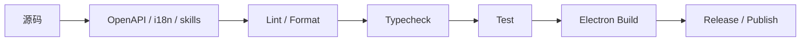

# 09-构建测试与发布

## 构建系统概览

项目使用 `electron-vite` 5 作为桌面应用构建器，当前运行时基线是：

- Node `>=24.11.1`
- Electron `41.2.1`
- React `19.2.0`
- TypeScript `~5.8.3`

从 `package.json` 和 `electron.vite.config.ts` 可以看到，构建明确分为：

- 主进程构建
- preload 构建
- renderer 构建

## `electron.vite.config.ts` 的关键信息

### 主进程

- 配置 `@main`、`@shared`、`@logger`、`@mcp-trace/*` 等别名
- 大部分依赖 external 化
- 通过 `buildProxyBootstrapPlugin` 处理运行时依赖引导
- 在生产环境关闭多余 legal comments

### preload

- 使用 React SWC 插件处理 TS decorators
- 提供 `@shared` 与 Trace 相关别名

### renderer

- 使用 React SWC + Tailwind Vite 插件
- 支持可选 bundle visualizer
- 直接把 workspace 包映射到源码目录
- 定义多个 HTML 入口：主窗口、迷你窗口、选择助手、Trace 窗口

## Workspace 包如何参与构建

renderer 直接把若干 workspace 包 alias 到源码目录：

- `@cherrystudio/ai-core`
- `@cherrystudio/ai-sdk-provider`
- `@cherrystudio/extension-table-plus`
- `@mcp-trace/*`

这意味着开发态和构建态都可以直接消费本地源码，而不需要先发布包。

## 常用开发命令

| 命令 | 作用 |
| --- | --- |
| `pnpm dev` | 生成 OpenAPI 后启动开发环境 |
| `pnpm debug` | 以调试模式启动 Electron |
| `pnpm build` | 生成 OpenAPI、类型检查并构建 |
| `pnpm build:check` | `lint + openapi:check + test` |
| `pnpm typecheck` | node、web、aiCore 并发类型检查 |
| `pnpm lint` | oxlint + eslint + typecheck + i18n + format |
| `pnpm test` | Vitest 全量测试 |
| `pnpm format` | Biome format + lint 写回 |

## 测试与质量门禁

当前工程脚本把质量门禁拆成两层：

### 基础检查

- `pnpm test:lint`
- `pnpm format:check`
- `pnpm typecheck`
- `pnpm i18n:check`
- `pnpm i18n:hardcoded:strict`
- `pnpm openapi:check`
- `pnpm skills:check`

### 测试检查

- `pnpm test:main`
- `pnpm test:renderer`
- `pnpm test:aicore`
- `pnpm test:shared`
- `pnpm test:scripts`

聚合命令是 `pnpm ci`。

## 其他工程能力

工程脚本中还包括：

- OpenAPI 生成与校验
- i18n 同步与翻译
- skills 同步与校验
- agents schema 生成、push、studio
- bundle 分析
- changeset 发布与版本脚本
- `electron-builder` 的多平台打包

## 工程原则总结

## 构建系统对架构的启示

- 这是多入口桌面应用，而不是单网页。
- 主进程、preload、renderer 的边界在构建层被明确区分。
- AI Core、Trace、Provider 扩展被当作一级模块对待。
- 工程脚本本身已经体现出当前架构的分层和质量约束。
