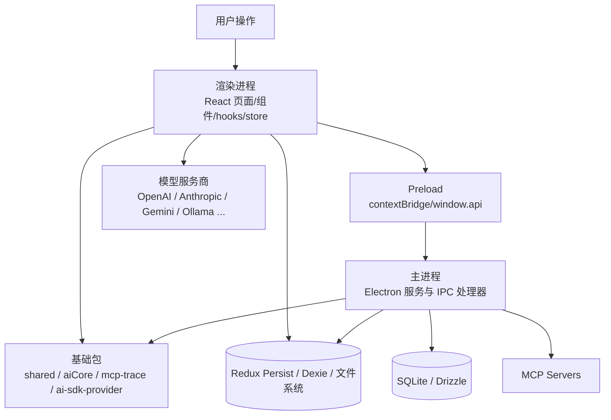

# 架构专题

本专题面向希望理解 Cherry Studio 内部实现的开发者，重点回答三个问题：

1. 这个项目由哪些运行时和模块组成？
2. 用户一次操作会经过哪些层？
3. 代码应该去哪里看，职责边界在哪里？

## 阅读顺序

- [01-总览](./01-%E6%80%BB%E8%A7%88/README.md)
- [02-运行时架构](./02-%E8%BF%90%E8%A1%8C%E6%97%B6%E6%9E%B6%E6%9E%84/README.md)
- [03-主进程](./03-%E4%B8%BB%E8%BF%9B%E7%A8%8B/README.md)
- [04-渲染进程](./04-%E6%B8%B2%E6%9F%93%E8%BF%9B%E7%A8%8B/README.md)
- [05-预加载与IPC](./05-%E9%A2%84%E5%8A%A0%E8%BD%BD%E4%B8%8EIPC/README.md)
- [06-数据与状态](./06-%E6%95%B0%E6%8D%AE%E4%B8%8E%E7%8A%B6%E6%80%81/README.md)
- [07-AI核心与模型接入](./07-AI%E6%A0%B8%E5%BF%83%E4%B8%8E%E6%A8%A1%E5%9E%8B%E6%8E%A5%E5%85%A5/README.md)
- [08-MCP与扩展能力](./08-MCP%E4%B8%8E%E6%89%A9%E5%B1%95%E8%83%BD%E5%8A%9B/README.md)
- [09-构建测试与发布](./09-%E6%9E%84%E5%BB%BA%E6%B5%8B%E8%AF%95%E4%B8%8E%E5%8F%91%E5%B8%83/README.md)

## 核心结论

Cherry Studio 不是单一前端项目，而是一个围绕 Electron 组装的多层系统：

- `src/main` 是桌面宿主和系统能力中心，管理窗口、协议、文件、备份、MCP、API Server、知识库和追踪。
- `src/preload` 是安全桥，把主进程能力裁剪后暴露给前端。
- `src/renderer/src` 是 React 19 单页应用和多个独立窗口入口。
- `packages/*` 是可复用基础设施，主要包括共享类型、AI Core、追踪能力和 AI SDK Provider 扩展。
- 数据层同时使用前端本地存储与主进程数据库：Redux + Dexie 面向 UI，Drizzle + SQLite 面向 agents 子系统。

## 全局分层图

## 代码地图

| 目录 | 角色 |
| --- | --- |
| `src/main` | Electron 主进程、窗口管理、IPC 注册、系统服务 |
| `src/preload` | 安全桥接层，定义 `window.api` |
| `src/renderer/src` | 主界面与多窗口前端 |
| `packages/shared` | 跨进程常量、类型、IPC channel、公共工具 |
| `packages/aiCore` | 统一模型执行抽象、provider 注册、插件链、运行时 |
| `packages/ai-sdk-provider` | CherryIN 等 AI SDK provider 扩展 |
| `packages/mcp-trace` | OpenTelemetry 风格的调用追踪基础能力 |

## 适合先看的源码入口

- 主进程启动：`src/main/index.ts`
- IPC 注册：`src/main/ipc.ts`
- 主窗口创建：`src/main/services/WindowService.ts`
- 预加载入口：`src/preload/index.ts`
- 主窗口 HTML 入口：`src/renderer/index.html`
- 主渲染入口：`src/renderer/src/entryPoint.tsx`
- 应用壳：`src/renderer/src/App.tsx`
- 路由：`src/renderer/src/Router.tsx`
- Redux Store：`src/renderer/src/store/index.ts`
- Dexie 数据库：`src/renderer/src/databases/index.ts`

