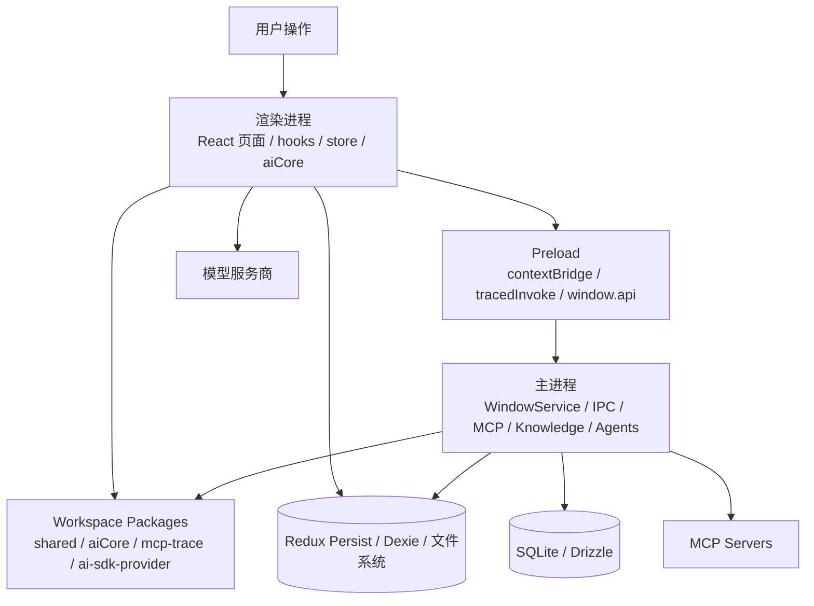

# 架构专题

本专题面向需要快速理解 Cherry Studio 当前代码结构的开发者，重点回答三件事：

1. 应用由哪些运行时和目录组成。
2. 一次用户操作会经过哪些边界。
3. 代码应该去哪里读，修改应该落在哪一层。

## 阅读顺序

- [01-总览](./01-总览/README.md)
- [02-运行时架构](./02-运行时架构/README.md)
- [03-主进程](./03-主进程/README.md)
- [04-渲染进程](./04-渲染进程/README.md)
- [05-预加载与IPC](./05-预加载与IPC/README.md)
- [06-数据与状态](./06-数据与状态/README.md)
- [07-AI核心与模型接入](./07-AI核心与模型接入/README.md)
- [08-MCP与扩展能力](./08-MCP与扩展能力/README.md)
- [09-构建测试与发布](./09-构建测试与发布/README.md)

## 当前架构结论

Cherry Studio 不是单一前端项目，而是一个围绕 Electron 41 组织的多层桌面系统：

- `src/main` 是桌面宿主，负责窗口、协议、IPC、高权限服务和长期运行任务。
- `src/preload` 是安全桥，把主进程能力裁剪为 `window.api` 与追踪能力。
- `src/renderer/src` 是 React 19 应用和多个窗口入口，负责 UI、产品编排和本地状态。
- `packages/*` 是跨运行时复用的基础设施，主要包括 `shared`、`aiCore`、`mcp-trace`、`ai-sdk-provider`。
- 数据同时分布在 Redux Persist、Dexie、文件系统和主进程 SQLite 中，不同职责落在不同层。

## 全局分层图

## 代码地图

| 目录 | 角色 |
| --- | --- |
| `src/main` | Electron 主进程入口、系统服务、IPC 注册、Agent 子系统 |
| `src/preload` | `contextBridge` 暴露层、IPC trace 透传 |
| `src/renderer/src` | 主窗口、多窗口前端、Redux、Dexie、渲染侧 AI 编排 |
| `packages/shared` | 跨进程类型、常量、`IpcChannel`、共享工具 |
| `packages/aiCore` | 统一 AI 运行时、Provider Extension、插件生命周期 |
| `packages/ai-sdk-provider` | Cherry Studio 自定义 AI SDK Provider 扩展 |
| `packages/mcp-trace` | 跨运行时 Trace 核心、Node/Web Tracer |
| `packages/extension-table-plus` | TipTap 表格扩展 |

## 推荐先读的源码入口

- 主进程启动：`src/main/index.ts`
- IPC 注册：`src/main/ipc.ts`
- 主窗口创建：`src/main/services/WindowService.ts`
- 预加载入口：`src/preload/index.ts`
- 渲染初始化：`src/renderer/src/init.ts`
- React 入口：`src/renderer/src/entryPoint.tsx`
- 应用壳：`src/renderer/src/App.tsx`
- 路由：`src/renderer/src/Router.tsx`
- Redux Store：`src/renderer/src/store/index.ts`
- Dexie 数据库：`src/renderer/src/databases/index.ts`
- 渲染侧 AI 编排：`src/renderer/src/services/ApiService.ts`
- AI 执行内核：`packages/aiCore/src/index.ts`
